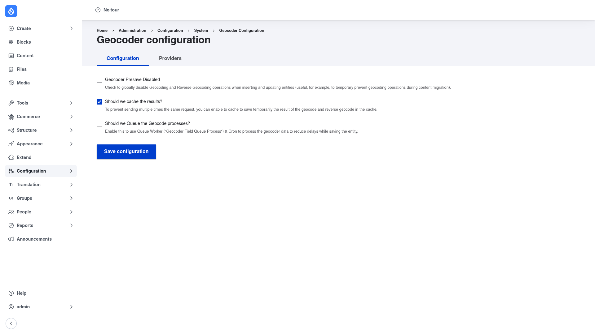

# Installation

## Requirements

Geocoder needs **Drupal 9.5, 10 or 11** and **PHP 7.3 or newer**. Unlike many
contrib modules it does **not** depend on other Drupal modules — instead it
depends on a set of PHP libraries that Composer pulls in automatically:

- **`willdurand/geocoder`** (`^4.0 || ^5.0`) — the underlying geocoding library
  that Geocoder wraps.
- **`php-http/guzzle7-adapter`** (`^1.0`) — HTTP client adapter used to talk to
  the remote geocoding services.
- **`php-http/message`** (`^1.6`) — HTTP message utilities.
- **`davedevelopment/stiphle`** (`^0.9.2`) — the rate-limiting / throttle library
  Geocoder uses to respect each provider's request limits.

Individual geocoding providers live in **their own `geocoder-php/*` packages**.
The base module ships the plugin definitions, but for a provider like Google Maps
you also install its library — for example `composer require
geocoder-php/google-maps-provider`. Nominatim / OpenStreetMap works without an
extra package. Add these per site as you decide which providers to use.

Optional companion modules extend Geocoder into Drupal fields:

- **Geofield** (`drupal/geofield`) — store geocoded coordinates in a Geofield
  (via the bundled `geocoder_geofield` submodule).
- **Address** (`drupal/address`) — geocode from / reverse-geocode into Address
  fields (via the bundled `geocoder_address` submodule).

## Install with Composer

From the project root:

```bash
composer require drupal/geocoder -W
```

The `-W` (`--with-all-dependencies`) flag lets Composer install and update the PHP
libraries listed above as needed.

> **Using DDEV?** Prefix Composer and Drush with `ddev` when you run from your host
> machine — `ddev composer require drupal/geocoder -W`, `ddev drush …`. Inside the
> container (`ddev ssh`) run them without the prefix.

## Enable the module

```bash
drush en geocoder -y
```

To use the field-integration features (geocoding one field into another), also
enable the relevant submodule, for example `drush en geocoder_field -y` — and
`geocoder_geofield` or `geocoder_address` if you are targeting a Geofield or
Address field.

## A note on API keys

Some providers require an **API key** or account credentials (Google Maps,
Mapbox, TomTom, MaxMind and others). **Never hard-code or commit a key.** Store it
in an environment variable and reference it through Drupal's **Key** module (or a
`getenv()` call in `settings.php`) so the secret stays out of version control. The
free Nominatim / OpenStreetMap provider needs no key, which makes it a good choice
for a first test.

## Verify it worked

Log in as an administrator and go to **Configuration → System → Geocoder**
(`/admin/config/system/geocoder`). You should see the **Geocoder configuration**
page with a **Configuration** tab and a **Providers** tab:



If that page loads with both tabs present, the module is installed correctly. Next,
review the [configuration](../configuration/index.md) and add a provider.
