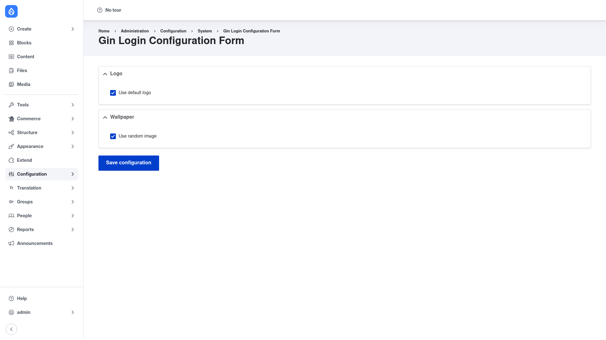

# Configuration — logo and wallpaper

Gin Login is configured from a single screen. Here you decide which **logo** and
which **wallpaper** (the large brand image beside the form) appear on your login,
registration and password-reset pages. The screen has two sections — **Logo** and
**Wallpaper** — each of which offers a sensible default plus the option to supply
your own image.

> The accent color, focus color, dark mode and high-contrast look of the login
> screen come from the **Gin theme itself**, not from this form. To change those,
> visit the Gin theme settings page rather than this screen.

## Open the configuration form

1. Log in as an administrator.
2. Go to **Configuration → System → Gin Login**
   (`/admin/config/system/configuration/gin-login`).

## Set the logo

The **Logo** section controls the brand mark shown above the login form.

1. By default, **Use default logo** is ticked, which means Gin Login shows Drupal's
   standard site logo. Leave it ticked if you are happy with the current site logo.
2. To use your own logo, **untick Use default logo**. This reveals two ways to
   supply a custom image:
   - A **path field**, where you can type the location of an image that already
     exists in your site's public files directory (for example a `public://` file).
   - A **file upload**, where you can browse for and upload a new logo image.
     Uploaded files are copied into the site's default file storage.
3. Accepted logo formats are `png`, `gif`, `jpg`/`jpeg`, `apng`, `webp`, `avif` and
   `svg`.

## Set the wallpaper

The **Wallpaper** section controls the large brand image displayed next to the login
card.

1. By default, **Use random image** is ticked, so Gin Login shows one of its bundled
   wallpapers, picked at random — zero setup required.
2. To use your own brand image, **untick Use random image**. As with the logo, this
   reveals a **path field** (point to an existing image in your public files
   directory) and a **file upload** (upload a new one).
3. The wallpaper accepts the same image formats as the logo **except `svg`** — it
   must be a raster image (`png`, `gif`, `jpg`/`jpeg`, `apng`, `webp`, `avif`).

## Save

Click **Save configuration** at the bottom of the form. Your logo and wallpaper
choices are stored in the exportable `gin_login.settings` configuration object, so
they can be deployed between environments like any other Drupal config.

## Check the result

Open `/user/login` — ideally in a private/incognito window, since you are logged in
as an administrator — and confirm the login form now shows your chosen logo and
wallpaper on the Gin-styled card. The same styling applies to the registration page
(`/user/register`) and the password-reset page (`/user/password`).
