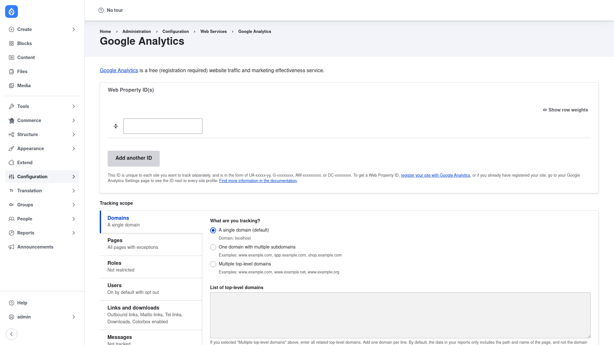

# Installation

## Requirements

Google Analytics runs on **Drupal 9.5, 10, or 11** (`core_version_requirement:
^9.5 || ^10 || ^11`). Its only hard dependency is core's **Path Alias**
(`path_alias`) module, which ships with Drupal and is enabled automatically.

Optional but recommended:

- **Token** (`token`) — enables extra token replacements (for example user role
  names and IDs) that you can use in custom dimensions and custom code snippets.
  Install it with `composer require drupal/token` if you want that richer
  placeholder support.

## Install with Composer

From the project root:

```bash
composer require drupal/google_analytics -W
```

The `-W` (`--with-all-dependencies`) flag lets Composer update any dependencies
as needed.

> **Using DDEV?** Prefix Composer and Drush with `ddev` when you run from your host
> machine — `ddev composer require drupal/google_analytics -W`, `ddev drush …`.
> Inside the container (`ddev ssh`) run them without the prefix.

## Enable the module

```bash
drush en google_analytics -y
```

This also enables core's `path_alias` module as a dependency. Once enabled, the
settings screen appears under **Configuration → Web Services → Google Analytics**
(`/admin/config/services/google-analytics`).

## Verify it worked

Log in as an administrator and go to
`/admin/config/services/google-analytics`. You should see the **Google Analytics**
settings form with a **Web Property ID(s)** section at the top and a **Tracking
scope** area below it:



If the page loads with the Web Property ID field and the Tracking scope tabs
(Domains, Pages, Roles, Users, Links and downloads, Messages), the module is
installed correctly. Next, head to [Configuration](../configuration/index.md) to
enter your Measurement ID and choose what to track.
