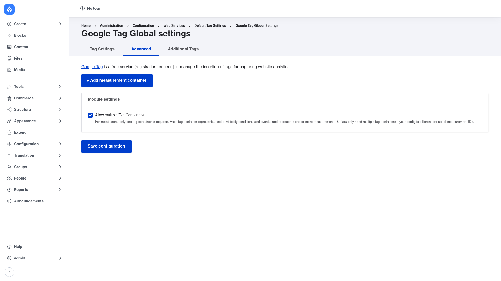

# Installation

## Requirements

Google Tag runs on **Drupal 9.5, 10, or 11** (`core_version_requirement:
^9.5 || ^10 || ^11`). It has **no required contrib dependencies** — the core
module works on its own.

Several optional modules unlock extra features when they are present; Google Tag
detects them automatically:

- **CSP** (`drupal/csp`) — Content-Security-Policy integration, adding a nonce to
  the injected tags.
- **Commerce** (`drupal/commerce`) — emits ecommerce events such as
  `add_to_cart`, `begin_checkout`, `purchase`, and `refund`.
- **Webform** (`drupal/webform`) — emits conversion/purchase events from Webform
  submissions.
- **Search API** (`drupal/search_api`) — emits `search` events from Search API
  queries.
- **Token** (`drupal/token`) — token replacement in custom dimensions/metrics and
  event data.

You only need these if you want the corresponding integrations; you can add them
later.

## Install with Composer

From the project root:

```bash
composer require drupal/google_tag -W
```

The `-W` (`--with-all-dependencies`) flag lets Composer update any shared
dependencies as needed.

> **Using DDEV?** Prefix Composer and Drush with `ddev` when you run from your
> host machine — `ddev composer require drupal/google_tag -W`, `ddev drush …`.
> Inside the container (`ddev ssh`) run them without the prefix.

## Enable the module

```bash
drush en google_tag -y
```

## Verify it worked

Log in as an administrator and go to **Configuration → Services → Google Tag**
(`/admin/config/services/google-tag`). You should reach the **Google Tag Global
settings** page:



If the page loads and shows the **Tag Settings / Advanced / Additional Tags**
tabs and an **Add measurement container** button, the module is installed
correctly. Next, review the [configuration guide](../configuration/index.md) to
add your first tag container.
