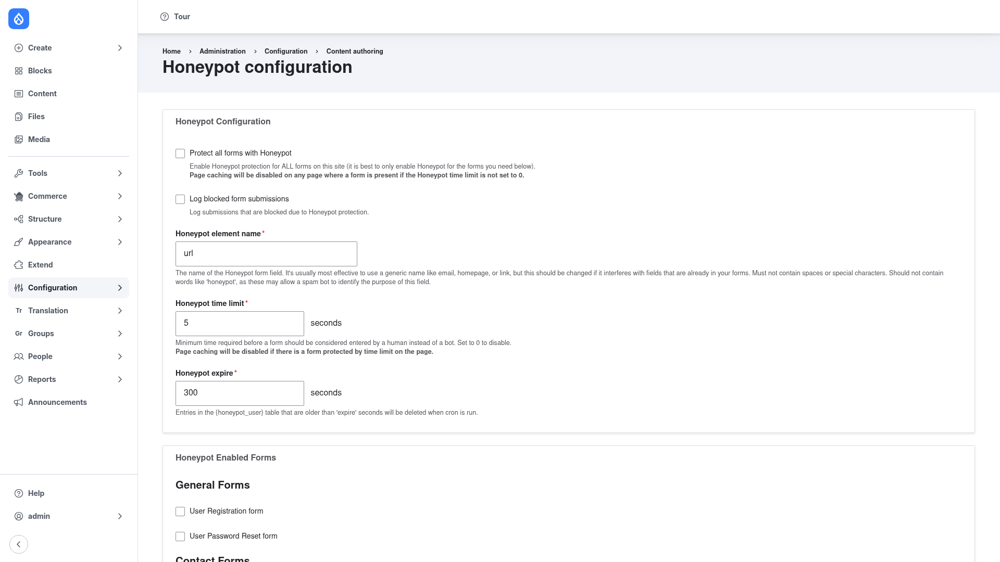

# Honeypot — manual setup guide

**Honeypot** (`honeypot`) blocks spam bots from your Drupal forms using two
invisible techniques — and it never shows a puzzle to a real visitor. The first
technique is a **hidden honeypot field**: an extra form field (named `url` by
default) that is invisible to humans but that automated spam bots tend to fill
in. Any submission that arrives with that field populated is rejected. The
second is a **time restriction**: a form completed impossibly fast — quicker
than a configurable number of seconds — is treated as a bot and rejected.

Because both checks happen behind the scenes, Honeypot is a friction-free
alternative (or complement) to CAPTCHA. This guide is written for a **human**
clicking through the admin UI: it walks you from installing the module to
protecting your first forms, with screenshots of each step. If you are after
terse, token-cheap references for an AI coding agent, read the sibling
[`agent/`](../agent/start.md) docs instead.

## Contents

1. [Installation](installation/index.md) — install the module with Composer and
   enable it.
2. [Configuration](configuration/index.md) — turn on protection, choose which
   forms to guard, and tune the hidden field and time limit.

## Where it lives in the admin menu

Everything in this guide sits at **Configuration → Content authoring → Honeypot
configuration** (`/admin/config/content/honeypot`). Reaching it requires the
**administer honeypot** permission.
