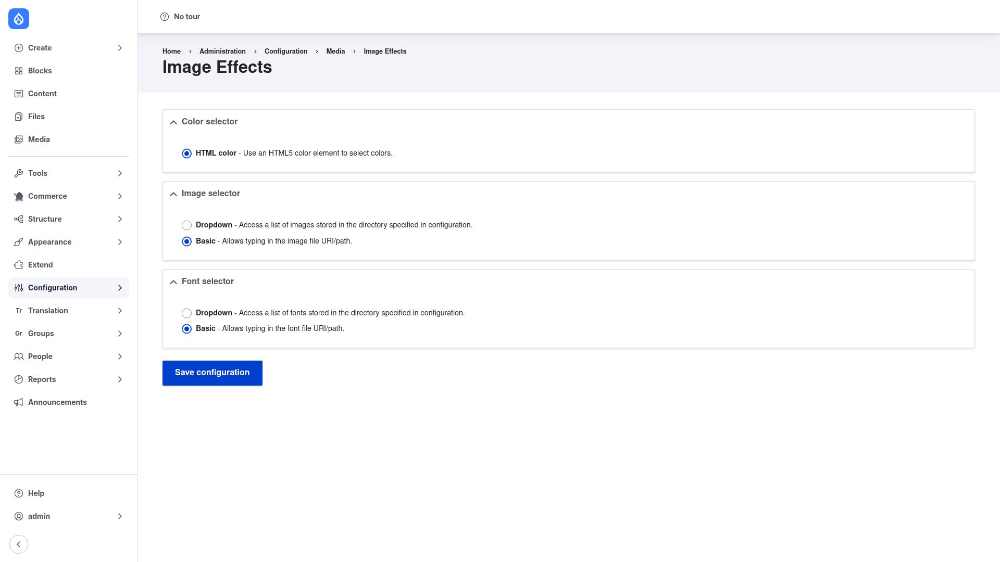

# Configuration

Configuring Image Effects happens in two places:

1. **The module settings page** — where you choose the color, image, and font
   selector plugins that the effects reuse. You usually set this once.
2. **The Image styles screen** — where you actually apply the effects, one at a
   time, on the image styles your site uses.

This page covers both.

## Part 1 — Choose the selector plugins

Image Effects gives several effects a shared way of picking a **color**, an
**image**, or a **font**. Rather than hard-coding one widget, it lets you choose
which selector plugin backs each of those pickers. That choice is made here, and it
then applies to every effect form that needs a color, image, or font.

### Open the settings page

1. Go to **Configuration → Media → Image Effects settings**
   (`/admin/config/media/image_effects`).

The page has three collapsible sections, each a radio-button list of the available
plugins.

### Color selector

Controls how colors are chosen in effect forms (for example the background color of
a **Rotate** effect, or the text color of a **Text Overlay**).

- **HTML color** — use an HTML5 color element (the browser's native color picker) to
  select colors. This is the default.

### Image selector

Controls how overlay, background, and mask images are chosen (for example the logo
for a **Watermark** effect).

- **Basic** — lets you type in the image file URI/path directly. This is the
  default.
- **Dropdown** — presents a list of images stored in a directory you specify in the
  plugin's configuration, so editors pick from a menu instead of typing a path.

### Font selector

Controls how fonts are chosen for the **Text Overlay** effect.

- **Basic** — lets you type in the font file URI/path directly. This is the
  default.
- **Dropdown** — presents a list of fonts stored in a directory you specify in the
  plugin's configuration, so you pick from a menu instead of typing a path.

### Save

When you have made your choices, click **Save configuration**. The selected
plugins now back the color, image, and font pickers in every effect form.

> The defaults (HTML color, Basic image, Basic font) work out of the box, so you can
> leave this page untouched and go straight to applying effects.

## Part 2 — Apply an effect on an image style

The effects themselves are not added on the settings page — they are added on
individual **image styles**. Any content displayed through a style that carries an
effect gets that effect applied automatically when its derivative is generated.

1. Go to **Configuration → Media → Image styles**
   (`/admin/config/media/image-styles`). You will see the list of image styles on
   your site (for example *thumbnail*, *medium*, *large*).
2. Click **Edit** next to an existing style you want to change, or click **+ Add
   image style** to create a new one (give it a name and click **Create new
   style**).
3. On the style's edit form, find the **Effect** select list near the bottom
   labelled **Add a new effect** (or **Select a new effect**). Open it — alongside
   core's effects you will now see the Image Effects additions, such as
   **Watermark**, **Text overlay**, **Brightness**, **Contrast**, **Rotate**,
   **Auto orientation**, **Set canvas**, **Background**, and many more.
4. Choose the effect you want and click **Add**.
5. If the effect has options, a configuration form appears. Fill it in — this is
   where the selector plugins from Part 1 come into play (for example a color
   picker for a background color, or an image path field for a watermark). Explain
   each field as prompted, then click **Add effect** to add it to the style.
6. Back on the style's edit form, the effect now appears in the effect list. You can
   **drag the effects into the order** you want them applied (they run top to
   bottom), and edit or delete any of them later.
7. Click **Save** (or **Update style**) at the bottom to store the style.

The next time an image is rendered through that style, Drupal regenerates its
derivative with the new effect applied. To preview the result, view any content
that uses the style, or flush the style's derivatives so they are rebuilt.
