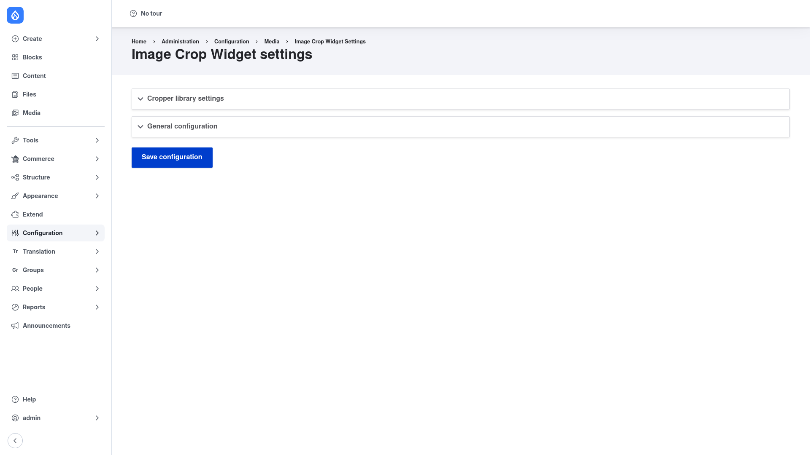

# Installation

## Requirements

Image Widget Crop needs **Drupal 9.5, 10, or 11** and one contrib module, which
Composer pulls in automatically:

- **Crop API** (`crop`, version `^2`) — the module that defines *crop types* and
  stores each crop as a `crop` entity. Image Widget Crop is essentially a user
  interface on top of it, so Crop must be present and configured. See the
  [Crop manual setup guide](../../../../crop/2.6.x/human-docs/index.md).

It also uses core's **Image** module (`image`), which ships with Drupal and provides
the image fields and image styles the widget works with; it is enabled automatically
as a dependency.

## Install with Composer

From the project root:

```bash
composer require drupal/image_widget_crop -W
```

The `-W` (`--with-all-dependencies`) flag lets Composer install and update the
`crop` dependency as needed.

> **Using DDEV?** Prefix Composer and Drush with `ddev` when you run from your host
> machine — `ddev composer require drupal/image_widget_crop -W`, `ddev drush …`.
> Inside the container (`ddev ssh`) run them without the prefix.

## Enable the module

```bash
drush en image_widget_crop -y
```

This also enables the `crop` and core `image` modules. Once enabled, the global
settings page appears under **Configuration → Media → Image Crop Widget**
(`/admin/config/media/crop-widget`).

The project also ships an optional **Image Widget Crop examples**
(`image_widget_crop_examples`) submodule that creates a ready-made content type
demonstrating the widget. Enable it only if you want the demo:

```bash
drush en image_widget_crop_examples -y
```

## Verify it worked

Log in as an administrator and go to `/admin/config/media/crop-widget`. You should
see the **Image Crop Widget settings** page with two collapsible sections —
*Cropper library settings* and *General configuration* — and a **Save
configuration** button:



If that page loads, the module is installed correctly. Next, work through the
[configuration guide](../configuration/index.md) to define crop types, build the
image styles, and turn the widget on for an image field.
