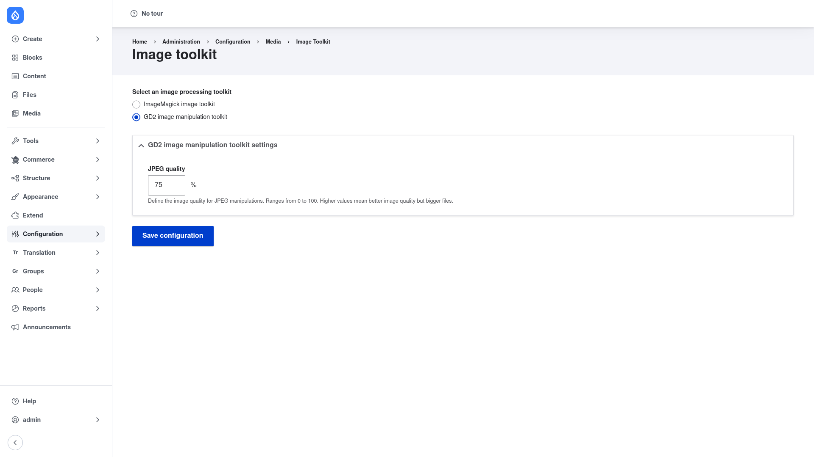

# ImageMagick — manual setup guide

**ImageMagick** (`imagemagick`) lets Drupal process images — image styles,
derivatives, thumbnails and uploads — with the **ImageMagick** (or
**GraphicsMagick**) command-line tools installed on your server, instead of
PHP's built-in **GD** library. Drupal's Image API is toolkit-based: out of the
box it uses GD, and this module registers an alternative `imagemagick` toolkit
that shells out to the `convert`/`identify` (ImageMagick) or `gm`
(GraphicsMagick) executables. Those tools typically produce higher-quality
output and support many more formats — WEBP, AVIF, TIFF, PDF, HEIC and more —
than GD can handle.

This guide is written for a **human** clicking through the admin UI. It walks
you, step by step and with screenshots, from installing the module to selecting
and configuring the toolkit by hand. If you are looking for terse, token-cheap
references for an AI coding agent, read the sibling [`agent/`](../agent/start.md)
docs instead.

## Where it lives in the admin menu

Everything in this guide sits on the core **Image toolkit** page at
**Configuration → Media → Image toolkit**
(`/admin/config/media/image-toolkit`). This is a core Drupal screen; installing
the ImageMagick module simply adds a second choice to it.

The screenshot above shows the toolkit page on this server. Note that the
**GD2 image manipulation toolkit** is the one currently selected here: that is
because the ImageMagick binary is not installed on this particular server, so
GD2 remains the active toolkit. Once you have installed the module *and* the
ImageMagick (or GraphicsMagick) binary, you would pick **ImageMagick image
toolkit** instead — see [Configuration](configuration/index.md).

## Contents

1. [Installation](installation/index.md) — install the module with Composer,
   enable it, and make sure the ImageMagick/GraphicsMagick binary is present on
   the server.
2. [Configuration](configuration/index.md) — select the ImageMagick toolkit and
   set the package, binaries path and enabled image formats.
