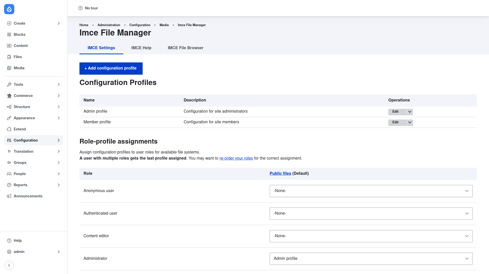

# Configuration

All of IMCE's setup happens on one page: **Configuration → Media → IMCE File
Manager** (`/admin/config/media/imce`), on the **IMCE Settings** tab. You need the
**Administer IMCE** permission (`administer imce`) to reach it. The page has two
parts, stacked top to bottom: a list of **Configuration Profiles**, and a
**Role-profile assignments** table that connects those profiles to your user roles.

## What a configuration profile is

A **profile** is a reusable bundle of file-manager rules. Each profile defines:

- **Allowed file extensions** — the file types a user may upload (for example
  `jpg png gif pdf`). Use `*` to allow any type.
- **Maximum file size** — the largest single upload allowed, in megabytes
  (for example `2` for a 2 MB cap).
- **Quota** — a per-user disk quota in megabytes (for example `50`), limiting the
  total size of everything a user has uploaded.
- **Maximum image width / height** — an upper bound in pixels for uploaded images;
  larger images are resized down on upload.
- **Thumbnail style** — the image style used to render thumbnail previews in the
  browser.
- **Folders** — a list of directories the profile can reach, each with its own
  **permissions** (see below). A folder path may contain **tokens** such as
  `users/user[user:uid]`, which expands to a different folder for every user — this
  is how you give each person a private personal folder.

Each folder in the profile has its own checkboxes controlling what users may do in
it. The standard ones are **browse files**, **upload files** and **delete files**,
plus **resize images** and **create / delete subfolders**. (Additional checkboxes
can be contributed by add-on IMCE plugins.) This lets you, for example, grant
browse-only access to one shared folder while allowing full upload and delete in a
user's personal folder.

You typically create a couple of profiles — say a generous one for editors and a
tighter one for ordinary members — and then assign each to the appropriate roles.

## Add or edit a profile

1. Go to **Configuration → Media → IMCE File Manager** (`/admin/config/media/imce`).
2. Click **+ Add configuration profile** to create a new one, or find an existing
   profile in the **Configuration Profiles** table and click **Edit** in its
   **Operations** column. The Operations button also has a dropdown for
   **Duplicate** (copy an existing profile as a starting point) and **Delete**.
3. Give the profile a **Name** (label) — this is what appears in the profile list
   and in the role-assignment dropdowns.
4. Set the upload rules: **allowed extensions**, **maximum file size**, **quota**,
   and the **maximum image width/height** if you want images auto-resized on upload.
5. Under **Folders**, add one or more folder paths the profile can access. For a
   private per-user folder, use a token path such as `users/user[user:uid]`. For
   each folder, tick the permissions you want to grant (browse, upload, delete,
   resize, create/delete subfolders).
6. Save the profile. It now appears in the **Configuration Profiles** list, ready to
   be assigned to roles.

## Assign profiles to roles

A profile does nothing until it is assigned to a role. Whether a user can use the
file browser at all is decided here — not by a permission, but by whether **any**
profile is assigned to one of their roles for the file system they are using.

The **Role-profile assignments** table sits below the profile list. Each **column**
is a file system (stream wrapper scheme) — **Public files** is shown by default, and
a **Private files** column appears when the private file system is configured on your
site. Each **row** is a user role.

1. Scroll to **Role-profile assignments**.
2. For each role (Anonymous user, Authenticated user, and any custom roles like
   Content editor or Administrator), pick a profile from the dropdown in the
   **Public files** column. Choose **-None-** to give that role no file access for
   public files.
3. If your site has a private file system, repeat for the **Private files** column —
   a role can use a different profile (or none) for private files.
4. Note the rule shown on the page: **a user with multiple roles gets the last
   profile assigned.** If someone holds several roles, IMCE uses the profile of the
   last-ordered role, so you may need to **re-order your roles** (there is a link on
   the page to the roles screen) to get the assignment you intend.
5. Click **Save configuration** at the bottom.

After saving, users in the assigned roles can open the browser at `/imce/public`
(or `/imce/private`) and wherever IMCE is wired into an editor or field.

## Wire IMCE into CKEditor

Once a role has a profile assigned, IMCE can act as the server file browser inside
the CKEditor 5 **link** and **image** dialogs. When a user who has IMCE access opens
the link or image dialog in the editor, IMCE adds an **Open File Browser** control
so they can pick an existing server file instead of pasting a URL or re-uploading.
This is attached automatically for text formats whose editor is CKEditor 5 — no
per-dialog setting is required — and it is hidden for users who have no IMCE profile
assigned. (IMCE also provides the file/image browser for **BUEditor** if you use
that editor.)

## Wire IMCE into a file or image field

IMCE can also add a browser to **file** and **image field widgets**, letting editors
choose an existing server file when filling in a field:

1. Go to the **Manage form display** screen for the entity type and bundle whose
   field you want (for example a content type's form display).
2. Open the settings for the file or image field's widget (the gear/edit icon).
3. Enable the IMCE option (the **Enable IMCE** third-party widget setting) and save
   the widget settings, then save the form display.

With that enabled, the field widget shows an **Open File Browser** button that opens
IMCE, so users can select a file that already exists on the server rather than
uploading a new copy.
