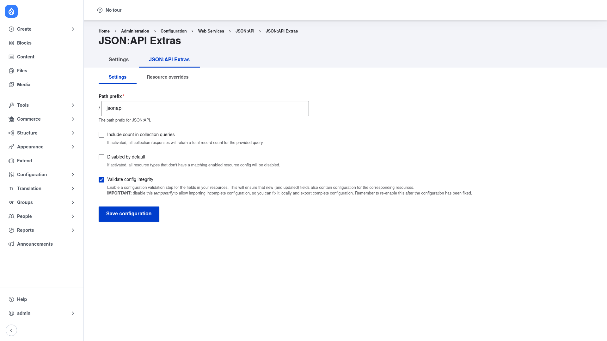

# JSON:API Extras — manual setup guide

**JSON:API Extras** (`jsonapi_extras`) customizes Drupal's built-in JSON:API so
your decoupled API matches what your front-end actually needs. Core JSON:API
exposes every entity type and field automatically, but with no configuration —
which leaks Drupal's internal naming (`node--article`, `field_body`) and
structure to every API consumer. JSON:API Extras layers a configuration UI on
top so you can:

- **Rename resource types** — expose `node--article` as a clean `article`.
- **Rename or hide fields** — surface `field_body` as `body`, or hide internal
  fields entirely.
- **Change the API path prefix** — serve the API from `/api` instead of the
  default `/jsonapi`.
- **Disable resource types** you don't want exposed, or lock the API down so
  only the resources you explicitly enable are published.
- **Apply field "enhancers"** — plugins that reshape a field's output (date
  formatting, JSON-string parsing, single-value flattening, link rewriting, and
  more).

It builds directly on core's **JSON:API** module and reshapes responses live, so
nothing is duplicated in your database. All overrides are stored as
configuration entities, which means they are exportable and deployable across
environments.

This guide is written for a **human** clicking through the admin UI. If you are
looking for terse, token-cheap references for an AI coding agent, read the
sibling [`agent/`](../agent/start.md) docs instead.

## Where it lives in the admin menu

Everything in this guide sits under **Configuration → Web services → JSON:API →
Extras** (`/admin/config/services/jsonapi/extras`). That page has two tabs:

- **Settings** — the global options: API path prefix, whether collections
  include a total count, whether resources are disabled by default, and
  configuration-integrity validation.
- **Resource overrides** — the per-resource configuration where you rename or
  disable resource types and individual fields, change a resource's URL path,
  and attach field enhancers.

## Contents

1. [Installation](installation/index.md) — install JSON:API Extras with Composer
   and enable it alongside core JSON:API.
2. [Configuration](configuration/index.md) — set the global options on the
   Settings tab, then override individual resources and fields on the Resource
   overrides tab.
