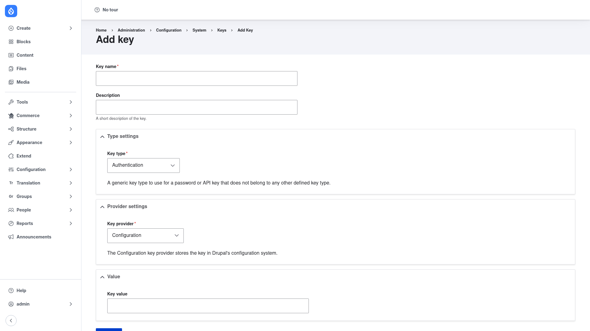

# Adding a key

This page walks through creating a single key from the admin UI. The goal is not
just to store a value, but to store it in a way that keeps the secret **out of your
configuration** wherever possible.

## Open the Add key form

1. Go to **Configuration → System → Keys** (`/admin/config/system/keys`).
2. Click **+ Add Key** (`/admin/config/system/keys/add`).



## Fill in the form

The form is divided into a few sections. Work through them top to bottom:

1. **Key name** — a human-readable name for the key, such as *OpenAI API Key* or
   *SMTP password*. This is what appears in the Keys listing and in the "select a
   key" dropdowns that other modules show you. (Drupal derives an internal machine
   name from it automatically.)

2. **Description** *(optional)* — a short note about what the key is for, useful when
   several people manage the site.

3. **Type settings → Key type** — choose *what the key is for*:
   - **Authentication** (the default) for a generic API key or password.
   - **Encryption** for an encryption key.
   - or one of the other types (user password, multivalue) if that fits your case.

   The help text under the dropdown explains the selected type — for
   **Authentication** it reads *"A generic key type to use for a password or API key
   that does not belong to any other defined key type."*

4. **Provider settings → Key provider** — choose *where the secret value is stored*.
   This is the most important decision on the form:
   - **Configuration** stores the value inside Drupal's config. It is the simplest
     option, but the secret will be included in your config export, so it is **not**
     recommended for real production secrets.
   - **File** reads the value from a file (place it outside the web root).
   - **Environment** reads the value from an **environment variable**. Because the
     secret then lives in the environment and never in config, this is the
     **recommended** choice for production credentials — the value never lands in
     your config export or your repository.

   The fields below the provider dropdown change depending on which provider you
   pick.

5. **Provider settings / Value** — fill in the settings for the provider you chose:
   - For **Configuration**, type the secret directly into the **Key value** field
     (shown in the screenshot above).
   - For **Environment**, enter the **name of the environment variable** that holds
     the secret (for example `OPENAI_API_KEY`) rather than the secret itself.
   - For **File**, enter the path to the file that contains the value.

   The File and Environment providers also offer options to **Base64-decode** the
   stored value and to **strip trailing line breaks** before the value is used,
   which is handy when a variable or file has stray whitespace.

6. Click **Save** at the bottom of the form. The new key appears in the
   [Keys listing](../configuration/index.md), with its **Type** and **Provider**
   shown in their own columns.

## Scriptable alternative: `drush key:save`

If you would rather create keys from the command line (for example in a deployment
script), Key ships Drush commands. The equivalent of adding an environment-backed
authentication key is:

```bash
drush key:save openai_api_key --label='OpenAI API Key' --key-type=authentication \
  --key-provider=env \
  --key-provider-settings='{"env_variable":"OPENAI_API_KEY","base64_encoded":false,"strip_line_breaks":true}' \
  --key-input=none -y
```

Here `openai_api_key` is the key's machine name, `--key-provider=env` selects the
Environment provider, and `env_variable` names the variable that holds the secret —
so, exactly as with the UI, the value stays out of config. Related commands include
`drush key:list` to list keys and `drush key:value-get <id>` to print a key's
resolved value for debugging.
