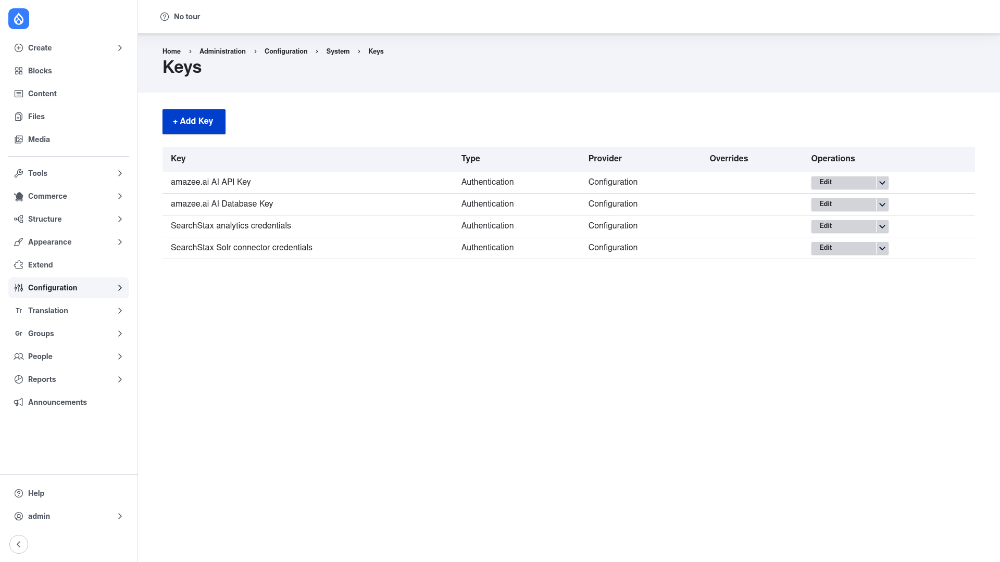

# Configuration — the Keys listing

Key does not have a global settings form. Everything you do with the module happens
on the **Keys** listing, where you create, edit, and review the keys your site uses.

## Open the Keys listing

1. Go to **Configuration → System → Keys** (`/admin/config/system/keys`).
2. You will see a table of every key defined on the site, plus an **+ Add Key**
   button.

Each row shows the key's name and, importantly, two separate pieces of information —
its **Type** and its **Provider**. Understanding the difference between these two is
the key to using the module well.

## Type vs. provider

Every key is assembled from two independent choices:

- **Key type** — *what the key is for*. This tells Drupal how the value should be
  treated and validated. The built-in types are:
  - **Authentication** — a generic API key or password. This is the default and
    covers most cases (Stripe keys, SendGrid keys, SMTP passwords, and so on).
  - **Encryption** — a key used for encrypting and decrypting data, with a
    configurable key size.
  - plus more specialised types such as a user-account password and a multivalue
    key (several named fields, like a username **and** a password, stored together).

- **Key provider** — *where the actual secret value is stored*. This is what
  determines whether your secret ends up in config or stays out of it:
  - **Configuration** — the value is stored inside Drupal's configuration system.
    This is the simplest option, but the secret **is** included in your config
    export, so avoid it for real production secrets.
  - **File** — the value is read from a file, typically placed **outside** the web
    root. The secret never enters config.
  - **Environment** — the value is read from an **environment variable**. The secret
    never enters config, which makes this the recommended choice for production
    credentials.

Because the type and the provider are chosen separately, the same kind of key (say,
an *Authentication* key) can be stored differently in different environments — for
example a **File** in development and an **Environment** variable in production —
without any module that references it having to change.

The **Provider** column on the listing above lets you see at a glance where each
key's secret lives. Keys whose provider is **Configuration** carry their value in
your exported config; keys backed by **Environment** or **File** do not.

To create a key, click **+ Add Key** and follow the
[Adding a key](../adding-a-key/index.md) walkthrough.
