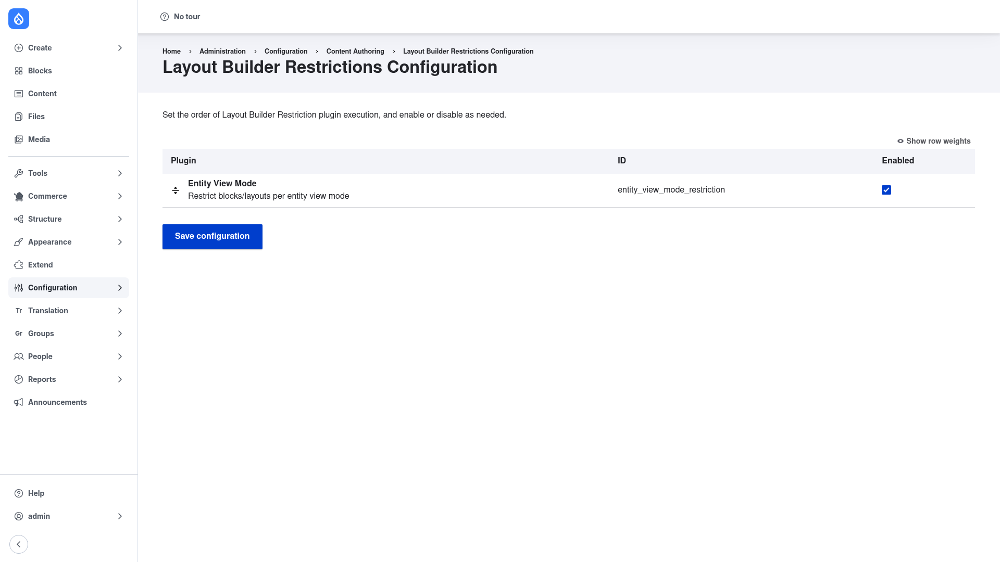

# Configuration

Setting up Layout Builder Restrictions happens in **two places**:

1. A **global admin page** where you enable, disable, and order the available
   restriction *plugins*.
2. The **per-view-mode Layout Builder settings** on each content type, where you
   actually pick which blocks and layouts editors may use.

This page covers both, in that order.

## Part 1 — Global restriction-plugin settings

This page decides which restriction *strategies* are active site-wide and in what
order they run. Out of the box the module ships a single plugin, **Entity View
Mode**, which is what lets you restrict blocks and layouts per view mode. More
plugins appear here only when you install submodules (such as *By Region*) or
custom plugins.

### Open the settings page

1. Go to **Configuration → Content authoring → Layout Builder Restrictions**
   (`/admin/config/content/layout-builder-restrictions`).

### Understand the fields

As the page explains, you *"Set the order of Layout Builder Restriction plugin
execution, and enable or disable as needed."* The table has one row per available
plugin:

- **Plugin** — the human name and description of the restriction strategy. The
  built-in **Entity View Mode** plugin is described as *"Restrict blocks/layouts
  per entity view mode"* — this is the one that powers everything in Part 2.
- **ID** — the machine name of the plugin (for example
  `entity_view_mode_restriction`).
- **Enabled** — tick this to make the plugin active. If you untick **Entity View
  Mode**, the per-view-mode restrictions in Part 2 stop being enforced.
- **Row order / weight** — drag the handle at the left of a row to reorder plugins.
  Click **Show row weights** (top right) to set the order with numeric weight
  fields instead of dragging. When more than one plugin is enabled, they run in
  this order, each one further narrowing what editors are allowed to do.

### Save

3. Click **Save configuration**. With only the default plugin installed you can
   leave **Entity View Mode** enabled and move straight on to Part 2.

## Part 2 — Restrict blocks and layouts for a view mode

The actual whitelisting and blacklisting of blocks and layouts is configured on
the display you want to lock down — not on the global page above. Restrictions are
set per **entity view mode** (for example the *Full content* display of the
*Landing page* content type), so you can, say, allow a rich set of components on a
landing page while keeping an article's body layout minimal.

The steps below assume Layout Builder is already turned on for the view mode you
want to restrict.

1. Go to **Structure → Content types**
   (`/admin/structure/types`) and, for the content type you want to govern, choose
   **Manage display**.
2. Select the **view mode** you want to restrict (for example *Default* / *Full
   content*, or *Teaser*), using the secondary tabs on the Manage display screen.
3. Make sure **Layout Builder** is enabled for that view mode — the *"Use Layout
   Builder"* checkbox under **Layout options** must be ticked and saved. Once it
   is, a **Manage layout** button appears.
4. Click **Manage layout** to open the Layout Builder defaults for that view mode.
5. On the defaults layout, open the **Layout Builder Restrictions** settings
   section that this module adds. This is where you configure the restrictions for
   this view mode.
6. Set the **allowed layouts**: either allow *all* installed layouts, or switch to
   a curated whitelist and tick only the layout plugins (for example *One column*,
   *Two column*) editors should be able to choose.
7. Set the **allowed blocks**, working through each block category (for example
   *Content fields*, *Inline blocks*, *System*). For each category you can allow
   the whole category, or whitelist/blacklist individual blocks within it — so you
   can, for instance, allow only *Content fields* and *Inline blocks* while hiding
   system and views blocks.
8. Optionally restrict which **inline-block types** (custom block bundles) editors
   may create in this view mode.
9. **Save** the layout.

From now on, when an editor builds a layout for that view mode, the block chooser
only offers the blocks you allowed, only the whitelisted layouts are selectable,
and disallowed blocks cannot be dragged into a region. Because these selections
are saved with the display's configuration, they export and deploy alongside the
rest of your site config.

> **Tip:** Repeat Part 2 for each content type and view mode you want to govern.
> Different view modes can have completely different rules — a permissive landing
> page and a locked-down teaser, for example.
