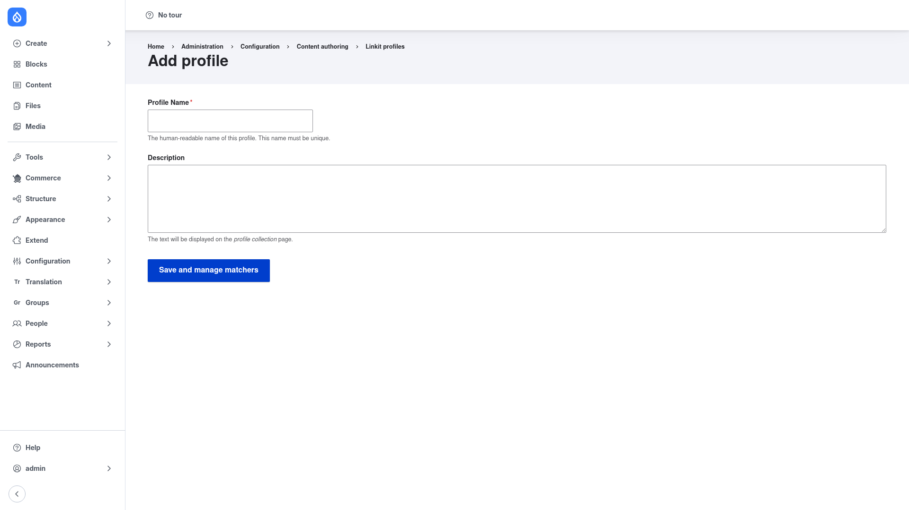

# Creating a profile

A **Linkit profile** is the piece of configuration that controls how Linkit behaves:
which content it can find, how each suggestion is labelled, and how the inserted
reference resolves back to a URL. You build a profile once, then attach it to a text
format so the format's link dialog uses it. This page covers both halves: creating
the profile, and switching it on in an editor.

## Open the Linkit profiles list

Go to **Configuration → Content authoring → Linkit**
(`/admin/config/content/linkit`). This is the profile collection page — it lists
every profile with its description and an **Operations** column for editing.

Linkit installs a **Default** profile when you enable it, so you will usually see at
least one row here. You can edit that one, or create your own with **+ Add profile**.

## Create the profile

Click **+ Add profile**. You get a short form:

Fill it in:

1. **Profile Name** *(required)* — the human-readable name of the profile, e.g.
   *Article picker*. This must be unique; Drupal derives the machine name from it.
2. **Description** *(optional)* — a sentence describing what the profile is for. This
   text is shown on the profile collection page (the list you just came from), so it
   is worth writing something that reminds you what the profile does.

Click **Save and manage matchers**. Saving takes you straight to the profile's
**Matchers** screen, because a profile with no matchers cannot find anything yet.

## Add matchers — the heart of the profile

A **matcher** is a plugin that searches one data source and returns suggestions. A
profile holds an **ordered list** of matchers, and that order is the order
suggestions appear in the autocomplete. On the profile's Matchers screen, add one
matcher per kind of thing you want authors to be able to link to. The bundled
matchers include:

- **Content** (nodes), **User**, **Taxonomy term**, **File**, and **Media** — search
  those entity types by title/name.
- **Contact form** — link to a site contact form by name.
- **Email** — turns what the author typed into a `mailto:` link.
- **Front page** — offers a suggestion that links to the site home page.
- **External URL** — allows arbitrary external addresses alongside internal
  suggestions.

For an **entity** matcher (Content, User, Term, File, Media, …) you can open its
settings to tune what it returns. The most useful settings are:

- **Bundles** — restrict suggestions to selected bundles only, e.g. only *Article*
  nodes rather than every content type.
- **Metadata / suggestion text** — the extra line shown beside each suggestion. It
  is token-enabled, so you can surface the author, status, date, and so on.
- **Result limit** and **include unpublished** — cap how many suggestions come back,
  and whether unpublished entities are offered.
- **Substitution type** — how the inserted reference resolves to a URL. The default
  **Canonical** points at the entity's page; **File** links directly to a file for
  download, and **Media** resolves to the media source.

Because matcher order sets suggestion order, put the content authors reach for most
at the top. Save the profile when you are done.

## Switch Linkit on in an editor

Creating a profile does nothing on its own — you have to attach it to a text
format's CKEditor 5 link dialog. Do this once per format that should use Linkit:

1. Go to **Configuration → Content authoring → Text formats and editors**
   (`/admin/config/content/formats`) and click **Configure** next to a format that
   uses **CKEditor 5** (for example *Full HTML*).
2. In that format's CKEditor 5 toolbar configuration, make sure the **Link** button
   (the Drupal link plugin) is in the active toolbar.
3. Open the **Link** plugin's settings and turn on the **Linkit** option, then
   choose the profile you created from the **Linkit profile** select. This is what
   swaps the plain URL field for Linkit's autocomplete.
4. Still on the same format, enable the **Linkit** filter under **Enabled filters**.
   This is the filter that rewrites the stored `entity:node/1` reference into a real
   URL at render time — without it, links are stored but not resolved. Make sure it
   runs **before** the *Limit allowed HTML* filter.
5. If **Limit allowed HTML** is enabled on the format, add `data-entity-type` and
   `data-entity-uuid` (and `title` if you want Linkit to set link titles
   automatically) to the allowed attributes on the `<a>` tag, otherwise those
   attributes are stripped and the reference is lost.

Save the format. Now, when an author uses the link button in an editor that uses
this format, typing in the link field searches your content and inserts a stable
internal reference instead of a raw path.
