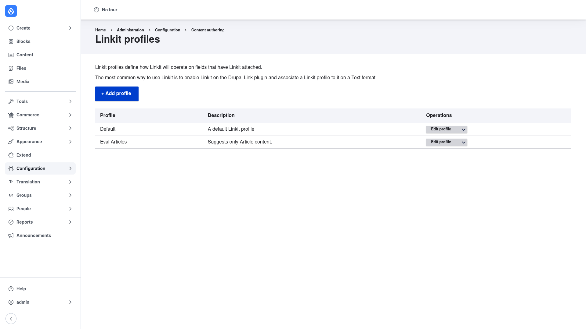

# Linkit — manual setup guide

**Linkit** (`linkit`) gives your WYSIWYG editor an autocomplete link picker. Instead
of making authors know and paste a URL, it turns the link field in CKEditor 5's link
dialog into a search box: start typing and Linkit suggests matching nodes, users,
taxonomy terms, files, media, contact forms, and any other entity that exposes a
canonical link. Pick a suggestion and the link is inserted for you.

Crucially, Linkit does not store the raw path. It records a stable **internal
reference** such as `entity:node/1` (plus `data-entity-*` attributes on the `<a>`
tag), and its **Linkit filter** rewrites that reference to a real URL when the page
is rendered. Because the link points at the *entity* rather than a path, it keeps
working even after the target's URL alias changes. What Linkit finds, how each
suggestion is labelled, and how references resolve to URLs are all driven by a
**Linkit profile** — a piece of configuration you build in the admin UI and then
attach to a text format.

This guide is written for a **human** clicking through the admin UI. It walks you,
step by step and with screenshots, from installing the module to creating a profile
and switching it on in an editor. If you want terse, token-cheap references for an
AI coding agent, read the sibling [`agent/`](../agent/start.md) docs instead.

## Contents

1. [Installation](installation/index.md) — install the module with Composer and
   enable it.
2. [Creating a profile](creating-a-profile/index.md) — build a Linkit profile, add
   matchers, and switch it on in a text format's CKEditor 5 link dialog.

## Where it lives in the admin menu

Everything in this guide sits under **Configuration → Content authoring**:

- Linkit profiles: **Configuration → Content authoring → Linkit**
  (`/admin/config/content/linkit`)
- Add a profile: `/admin/config/content/linkit/add`
- Text formats and editors (to switch Linkit on): **Configuration → Content
  authoring → Text formats and editors** (`/admin/config/content/formats`)
