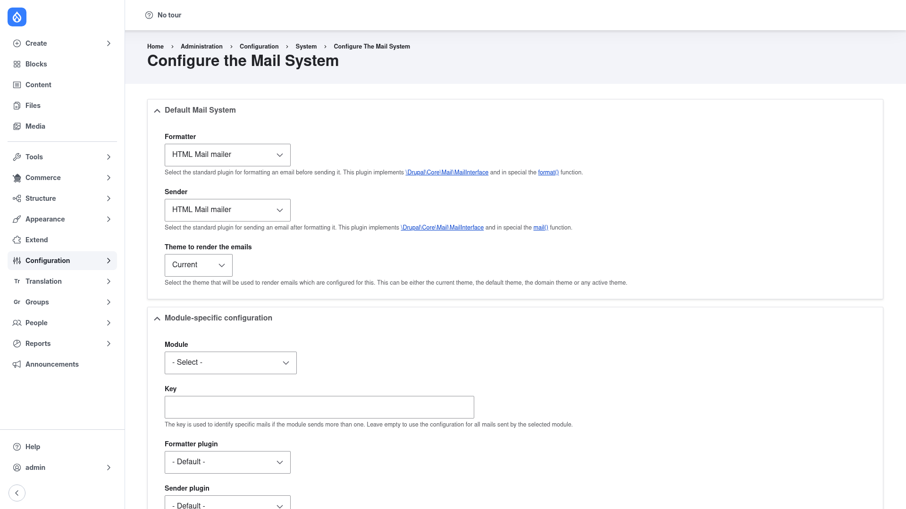

# Configuration

All of Mail System's setup happens on a single page. Here you choose the plugins that
format and send your site's mail, and optionally override those choices for specific
modules or mail keys.

## Open the settings page

1. Go to **Configuration → System → Mail System**
   (`/admin/config/system/mailsystem`).

## Formatter vs. sender

Every choice on this page is a **pair** of mail plugins:

- **Formatter** — the plugin that builds the message before it goes out: it assembles
  the body and headers (core calls its `format()` method). This is where you decide
  whether mail is plain text or rich HTML.
- **Sender** — the plugin that actually delivers the finished message (core calls its
  `mail()` method). This is the transport, for example PHP's built-in mailer or an SMTP
  server.

Splitting the two is the whole point of Mail System: you can, say, format mail as HTML
with one plugin while sending it through SMTP with another. The plugins available in
each dropdown come from Drupal core and from whatever contrib mail modules you have
installed.

## Set the site-wide default

The **Default Mail System** section at the top applies to all mail unless a
module-specific override matches it.

1. Under **Formatter**, choose the plugin that should format your mail. The help text
   notes that this plugin implements `\Drupal\Core\Mail\MailInterface` and, in
   particular, its `format()` function.
2. Under **Sender**, choose the plugin that should send it — the plugin implementing
   the `mail()` function.
3. Under **Theme to render the emails**, choose which theme renders HTML mail. The
   options are the **Current** theme (the active theme when the mail is sent), the
   default theme, the domain theme, or any specific active theme.

## Add a per-module (or per-key) override

The **Module-specific configuration** section lets you route one module's mail through
different plugins than the site default — for example, sending a particular module's
mail as HTML while everything else stays plain text.

1. Under **Module**, select the module whose mail you want to override.
2. Under **Key** (optional), enter a specific mail key if the module sends more than
   one kind of message and you only want to override that one. The key identifies a
   single mail; **leave it empty to apply the override to all mail sent by the selected
   module**.
3. Under **Formatter plugin**, choose the formatter for this override, or leave it on
   **- Default -** to keep the site-wide formatter.
4. Under **Sender plugin**, choose the sender for this override, or leave it on
   **- Default -** to keep the site-wide sender.

You can repeat this to add overrides for as many modules and keys as you need.

## Save

Click **Save configuration** at the bottom of the page. Your choices are stored as
exportable configuration (in `mailsystem.settings`), so you can deploy the same mail
routing across your dev, stage, and production environments.
