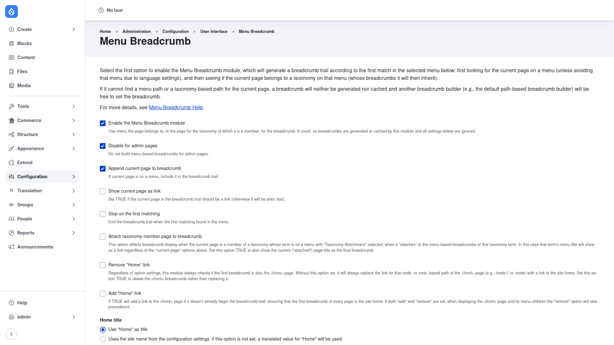

# Menu Breadcrumb — manual setup guide

**Menu Breadcrumb** (`menu_breadcrumb`) builds a page's breadcrumb from the
**menu the page belongs to**, so the trail mirrors your menu hierarchy rather
than the URL. If *About us* sits under *Company* in your main navigation, the
breadcrumb reads *Home › Company › About us* — the ancestor menu links, in
order — even when the page's path says nothing about that structure.

This is what sets it apart from path-based breadcrumb modules. Drupal core (and
alternatives like **Easy Breadcrumb**) derive the trail from the URL/route path,
which on menu-driven sites often produces sparse or incorrect trails. Menu
Breadcrumb instead walks the active **menu trail**, and can additionally attach a
trail derived from **taxonomy membership** for content tagged with a term whose
menu link has "Taxonomy Attachment" enabled. It relies only on Drupal core, and
all of its behavior is exportable configuration.

> **Menu Breadcrumb or Easy Breadcrumb?** Use **Menu Breadcrumb** when your
> pages are organized in menus and you want the breadcrumb to follow that menu
> hierarchy. Use **Easy Breadcrumb** when you want the breadcrumb to follow the
> URL path segments instead. They solve the same problem from opposite ends —
> pick the one that matches how your site is structured.

This guide is written for a **human** clicking through the admin UI. It walks
you, step by step and with screenshots, from installing the module to configuring
how the trail is built. If you are looking for terse, token-cheap references for
an AI coding agent, read the sibling [`agent/`](../agent/start.md) docs instead.

## Where it lives in the admin menu

All of Menu Breadcrumb's options live on a single settings page under
**Configuration → User interface → Menu Breadcrumb**
(`/admin/config/user-interface/menu-breadcrumb`). There are no blocks to place
and no per-content-type forms — once the module is enabled and its settings are
saved, it takes over breadcrumb generation site-wide.

## Contents

1. [Installation](installation/index.md) — install Menu Breadcrumb with Composer
   and enable it.
2. [Configuration](configuration/index.md) — turn on menu-based breadcrumbs and
   choose how the trail is built, from the current-page crumb to the Home link
   and the order in which menus are checked.
