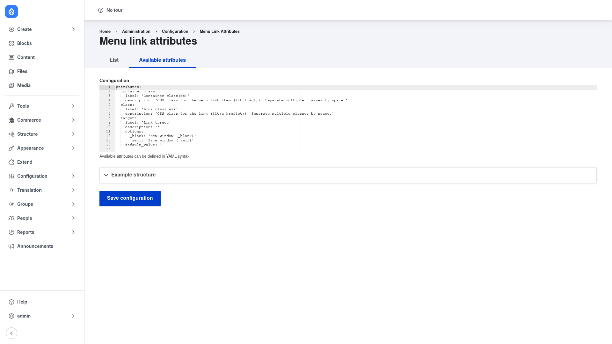

# Installation

## Requirements

Menu Link Attributes runs on **Drupal 8, 9, 10, or 11**
(`core_version_requirement: ^8 || ^9 || ^10 || ^11`) and depends on one core
module:

- **Custom Menu Links** (`menu_link_content`) — the core module that provides
  editable menu links. Drupal enables it automatically as a dependency, so you do
  not need to install anything extra.

Optional but recommended:

- **YAML Editor** (`yaml_editor`) — when installed, it gives the available-attributes
  configuration form a nicer YAML editing experience (syntax highlighting and
  indentation help). It is not required; the form works as a plain textarea without
  it.

## Install with Composer

From the project root:

```bash
composer require drupal/menu_link_attributes -W
```

The `-W` (`--with-all-dependencies`) flag lets Composer update any dependencies as
needed.

> **Using DDEV?** Prefix Composer and Drush with `ddev` when you run from your host
> machine — `ddev composer require drupal/menu_link_attributes -W`, `ddev drush …`.
> Inside the container (`ddev ssh`) run them without the prefix.

## Enable the module

```bash
drush en menu_link_attributes -y
```

This also enables core's `menu_link_content` module if it is not already on. Once
enabled, the configuration page appears under **Configuration → Menu Link
Attributes** (`/admin/config/menu_link_attributes/config`).

## Verify it worked

Log in as an administrator and go to `/admin/config/menu_link_attributes/config`.
You should see the **Menu link attributes** page with a YAML **Configuration**
textarea pre-filled with the default `container_class`, `class`, and `target`
attributes, and a **Save configuration** button:



If the page loads and shows the YAML editor, the module is installed correctly.
Next, review the [Configuration](../configuration/index.md) page to define which
attributes editors can set.
