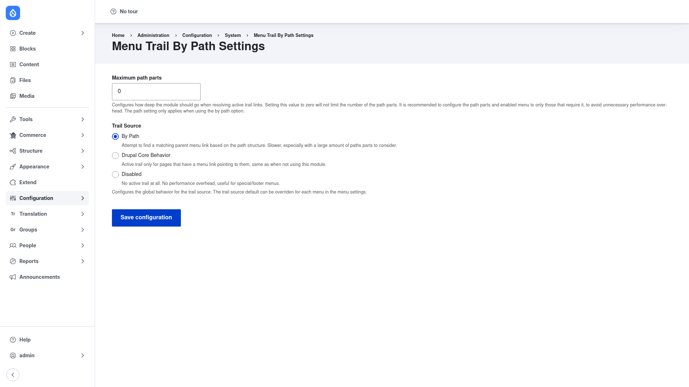

# Configuration — global settings

The settings page controls **how** Menu Trail By Path turns the current URL into an
active menu trail. There are only two options, and the defaults (resolve by path,
with no depth limit) are a sensible starting point — but it is worth understanding
each one before you rely on them, especially on a large site.

## Open the settings page

1. Log in as an administrator.
2. Go to **Configuration → System → Menu Trail By Path**
   (`/admin/config/system/menu_trail_by_path/settings`).

## Maximum path parts

The **Maximum path parts** field caps how deep into the URL the module walks when
it looks for a matching menu link. A value of `0` (the default) means **no limit** —
every segment of the path is considered. Set a positive number to stop after that
many segments.

This is a performance control. Resolving a very deep URL such as
`/docs/section/topic/page` means checking several path prefixes against your menu
links, and that cost grows with the number of segments. As the on-screen help
notes, it is recommended to restrict both the path depth and which menus use
path resolution to only those that actually need it, to avoid unnecessary
performance overhead. This setting only has an effect when the trail source is set
to **By Path** (below).

## Trail Source

The **Trail Source** radio group is the heart of the module. It decides where the
active trail comes from, globally, for every menu:

- **By Path** *(default)* — the module attempts to find a matching parent menu link
  based on the URL path structure. This is the behavior that makes a page like
  `/about/team` highlight the **About** menu item even when only "About" is in the
  menu. It is the slowest option, especially with a large number of path parts to
  consider, which is why the **Maximum path parts** limit exists.
- **Drupal Core Behavior** — the active trail is set only for pages that have a menu
  link pointing directly at them, exactly as if the module were not installed. Use
  this to turn the path-based behavior off without uninstalling.
- **Disabled** — no active trail is set at all. There is no performance overhead,
  which makes it a good choice for footer or utility menus where highlighting the
  current page adds nothing.

Pick the option you want and Drupal saves it as the **global** default.

## Save

Click **Save configuration** at the bottom of the form. Your choice takes effect
immediately: menu blocks that render the active trail will start (or stop)
highlighting parent items based on the URL, and core breadcrumbs built from the
active trail follow the same logic — so the breadcrumb on an out-of-menu page now
reflects its place in the URL hierarchy.

## Overriding the trail source for a single menu

The setting on this page is the **global default**, but as the help text under
Trail Source points out, it can be overridden per menu. When you edit an individual
menu under **Structure → Menus** (**Structure → Menus →** *Edit menu*), the module
adds a **Menu Trail Source** choice to that menu's edit form. Leave it empty to use
the global default you set above, or pick a specific source to apply just to that
one menu — for example, keep **By Path** globally for your main navigation while
setting a footer menu to **Disabled**.
