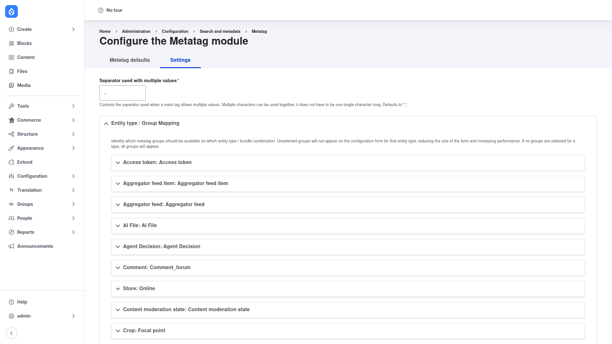

# Configuration — the module Settings page

Most of your day‑to‑day work with Metatag happens on the **Metatag defaults** list
(covered in [Managing defaults](../managing-defaults/index.md)). The **Settings** tab
holds the module‑wide options that apply across every default and every entity: how
multiple values are joined, and which tag groups are offered for which entity types.

## Open the settings page

1. Go to **Configuration → Search and metadata → Metatag**
   (`/admin/config/search/metatag`).
2. Click the **Settings** tab at the top of the page
   (`/admin/config/search/metatag/settings`).

You land on the **Configure the Metatag module** page:

## Separator used with multiple values

The first field controls the character used to join a meta tag that holds **multiple
values** (for example a list of keywords). It defaults to a comma (`,`). You can enter
more than one character if you want — the setting is not limited to a single
character. Leave it as the default unless you have a specific reason to change how
multi‑value tags are rendered.

## Entity type / Group Mapping

Below the separator is the **Entity type / Group Mapping** section. This is where you
decide **which metatag groups appear on which entity type / bundle** when you edit a
default or an individual entity.

Each row is an entity type and bundle (for example *Content moderation state*,
*Comment: Comment_forum*, *Store: Online*). Expand a row and tick the groups you want
to expose for it:

- **Selecting specific groups** limits the configuration form for that entity type to
  just those groups. This makes the edit form shorter and improves performance,
  because Drupal does not have to build every tag field.
- **Selecting nothing** for a type means *all* groups appear for it — the default
  behaviour.

Use this when a bundle only ever needs, say, Basic and Open Graph tags: restrict it to
those two groups so editors are not scrolling past dozens of irrelevant fields.

## Save

Adjust the separator and any group mappings you need, then save the form. These
settings take effect immediately on the default‑editing and per‑entity tag forms.
There is nothing else to configure here — the actual tag *values* are set on the
defaults themselves, which the next page covers.
