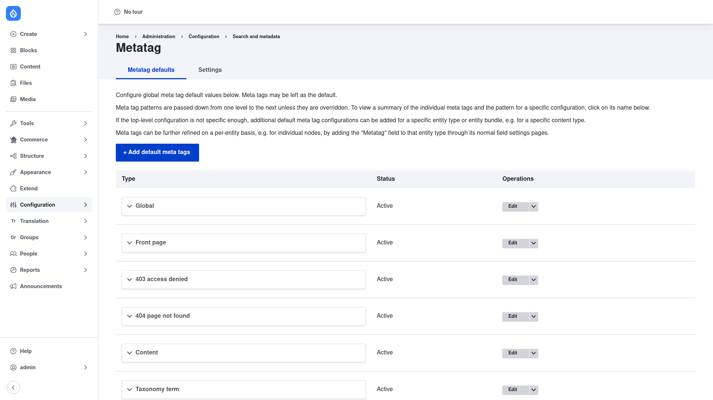
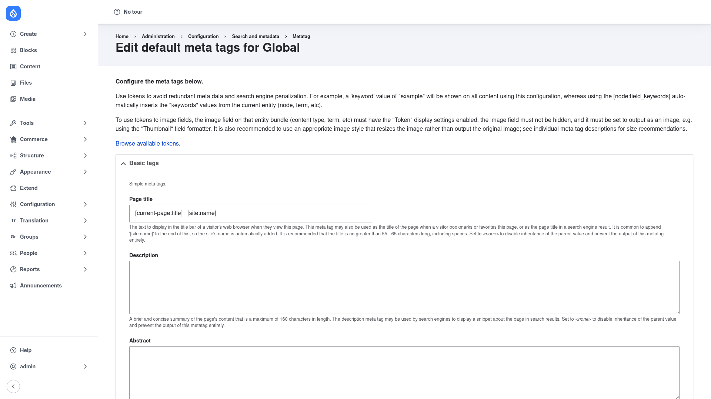

# Managing default meta tags

Default meta tags are the heart of Metatag. Each **default** is a saved set of tag
values that applies to a slice of your site — everywhere (Global), a special page
(Front page, 403, 404), or an entity type or content type (Content, Taxonomy term,
User). You rarely touch raw markup: you fill the defaults with **tokens** and Drupal
generates the correct `<meta>` tags for every page automatically.

## How defaults and inheritance work

Metatag applies tags in layers, from most general to most specific:

**Global → entity type → bundle → the individual entity.**

A more specific level **inherits** everything from the level above it, then overrides
only the tags you change. So the page title pattern you set on **Global** is used
everywhere, unless a **Content** default (or a single node's own Metatag field)
replaces it. This is why you usually configure Global once and only add narrower
defaults where a section genuinely needs different tags.

## The defaults list

Go to **Configuration → Search and metadata → Metatag**
(`/admin/config/search/metatag`). The **Metatag defaults** tab lists every default,
its **Status** (Active), and an **Operations** column:

From here you can:

- Click a default's **name** to see a summary of its individual tags and patterns.
- Use **Edit** in the Operations column to change a default's tag values.
- Use the Operations dropdown to **Revert** a shipped default back to its original
  values, or **Delete** a custom one you added.
- Click **+ Add default meta tags** to create a new default for a specific entity type
  or bundle (covered below).

## Editing a default (Global) with tokens

Click **Edit** on the **Global** row (`/admin/config/search/metatag/global`). Global
is the base of the inheritance chain, so what you set here affects the whole site.

The form opens with guidance and a **Browse available tokens** link, then groups the
tags into collapsible sections such as **Basic tags** (and, if you enabled the
submodules, **Open Graph**, **Twitter Cards**, and more). Work through the tags you
care about:

1. **Page title** — the text shown in the browser title bar, in bookmarks, and often
   as the headline in a search result. The shipped Global value is
   `[current-page:title] | [site:name]`, which renders the current page's title
   followed by your site name. Keep titles to roughly 55–65 characters. Set the field
   to `<none>` to disable inheritance of the parent value and suppress the tag
   entirely.
2. **Description** — a short summary (aim for 160 characters or fewer) that search
   engines may show as the snippet under your result. Use a token so it fills from the
   content — for example `[node:summary]` on a Content default — rather than typing a
   static sentence. Set it to `<none>` to disable it.
3. **Abstract** and the other Basic tags work the same way: a literal string is shown
   verbatim on every page, whereas a token is replaced per page from the current
   entity.

### Why tokens matter

A literal value like a `keywords` of `example` would appear on *every* page — which
search engines penalise. A token such as `[node:field_keywords]` instead inserts the
keywords from the current entity (node, term, etc.), so each page gets its own correct
value from one setting. Click **Browse available tokens** to see the full list you can
insert.

> **Tip for image tokens (Open Graph / Twitter images):** to use a token that points
> at an image field, that field on the bundle must have its **Token** display enabled,
> must not be hidden, and must be set to output as an image (e.g. the **Thumbnail**
> formatter). An image style that resizes the image is recommended over the original.

When you are done, save the form. The new values apply immediately to every page the
default covers.

## Adding a default for a specific entity type or bundle

When Global is not specific enough — say articles need a different title pattern than
basic pages — add a narrower default:

1. On the **Metatag defaults** list, click **+ Add default meta tags**
   (`/admin/config/search/metatag/add`).
2. Choose the **entity type / bundle** the default should apply to (for example a
   specific content type, a taxonomy vocabulary, or users).
3. Fill in only the tags you want to differ from the level above — everything you
   leave untouched is inherited. Use tokens scoped to that entity, e.g.
   `[node:summary]` for a content type's description.
4. Save. The new default appears in the list and immediately takes precedence over
   Global for that entity type or bundle.

## Overriding on a single entity

For one‑off pages — an important landing node, for instance — you do not need a new
default. Add a field of type **Meta tags** to that entity's bundle through its normal
**Manage fields** settings. Editors then get a Metatag section on the edit form where
they can override any tag for that individual entity; anything they leave blank keeps
inheriting from the defaults above.
