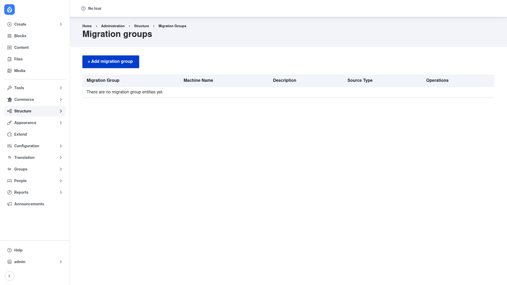

# Configuration — running your migrations

Migrate Tools has **no global settings form**; there is nothing to configure about
the module itself. Instead, "configuration" here means the two ways you actually
operate migrations: the **admin UI** and the **Drush commands**. The Drush commands
are the primary interface — they are what people use in day-to-day work, scripts,
and CI/CD — but the UI is a handy way to browse and run migrations from the browser.

The migrations you run are defined elsewhere (by Migrate Plus configuration or a
custom module); Migrate Tools just executes them. See
[Installation](../installation/index.md) for that distinction.

## Part 1 — The admin UI (Structure → Migrations)

The UI only appears when **Migrate Plus** is installed (it supplies the migration
group and migration configuration entities). Everything below requires the
**Administer migrations** permission.

### Browse migration groups

1. Go to **Structure → Migrations** (`/admin/structure/migrate`).
2. You land on the **Migration groups** page. Each row is a group — a named bundle
   of related migrations — with its machine name, description, source type, and an
   **Operations** menu. On a fresh site with nothing defined yet, the list is empty
   and reads "There are no migration group entities yet." That is expected.



### Open a group and see its migrations

1. From the **Migration groups** list, click the **List migrations** operation (or
   the group name) to open that group at
   `/admin/structure/migrate/manage/{group}/migrations`.
2. You now see the individual migrations in the group, each showing its status and
   counts, with links to view or run it.

### View, run, and roll back a migration

1. Click a migration to open its overview page. Tabs across the top let you inspect
   how it is wired up: **Source**, **Process**, and **Destination** show the plugin
   mappings, and **Messages** shows anything the migration has logged.
2. Click the **Execute** tab to run the migration from the browser. From there you
   can choose the operation — **Import** to pull source rows into their destination,
   or **Rollback** to undo a previous import and delete the records it created — and
   submit the form.
3. Click the **Messages** tab to read the per-row messages (errors and notices) a
   migration recorded, without touching the database.

## Part 2 — The Drush workflow (the main way people use it)

This is how migrations are run in practice. Each command below accepts a migration
ID; most also accept `--group=<group>` or `--tag=<tag>` to act on many migrations
at once. All commands assume Drush is installed (see
[Installation](../installation/index.md)).

### Check status — `drush migrate:status`

```bash
drush migrate:status
```

Lists every migration on the site with its **Status**, and its **Total**,
**Imported**, and **Unprocessed** row counts. This is where you start: it tells you
what migrations exist and how far each one has run. Alias: `drush ms`. For a fast,
names-only list use `drush ms --names-only`.

### Import — `drush migrate:import <id>`

```bash
drush migrate:import article
```

Runs a migration, importing source rows into their destination (for example,
creating the `article` nodes). Use `--group=<group>` to import a whole group,
`--tag=<tag>` to import everything with a given tag, or `--all` for every migration.
Useful options while testing or handling large sources:

- `--limit=N` — stop after N items (handy for a quick test run).
- `--update` — re-process items already imported, picking up changed source data.
- `--idlist=1,2,3` — only import those specific source rows.

A progress bar is shown for long-running imports. Alias: `drush mim`.

### Roll back — `drush migrate:rollback <id>`

```bash
drush migrate:rollback article
```

Undoes an import, deleting the destination records that migration created — the way
to start over cleanly if an import went wrong. Like import, it accepts `--group` and
`--tag` to roll back many migrations at once. Alias: `drush mr`.

### Read messages — `drush migrate:messages <id>`

```bash
drush migrate:messages article
```

Prints the messages (errors and notices) a migration logged for individual rows.
When an import reports failures, this is how you find out *which* rows failed and
why, straight from the command line. Alias: `drush mmsg`.

For the full command list — including `migrate:stop`, `migrate:reset-status`,
`migrate:disable`, `migrate:fields-source`, and `migrate:tree`, plus every option —
see the agent reference at [`agent/drush/commands.md`](../../agent/drush/commands.md).
