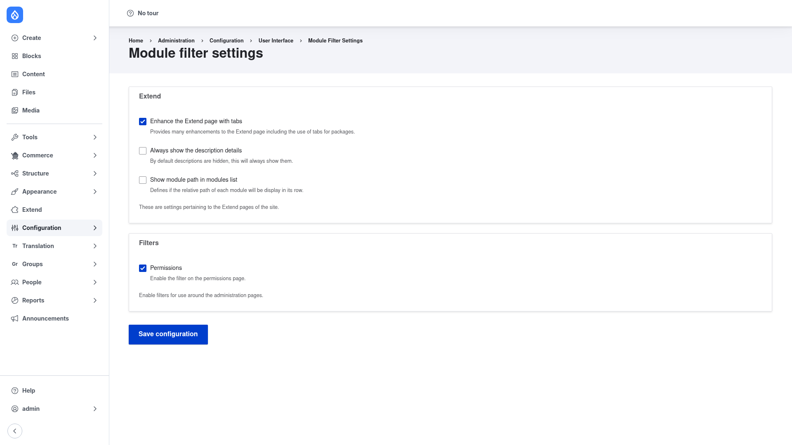

# Module Filter — manual setup guide

**Module Filter** (`module_filter`) makes Drupal's long **Extend** (modules) page
manageable. It adds a live search box at the top of the page that instantly hides
any module whose name doesn't match what you type, so you can find the module you
want without scrolling. It also converts the long list of package fieldsets into a
tidy **tabbed layout**, letting you jump between packages — or list every module
alphabetically — and enable what you need quickly.

The same filtering can be extended to the **Permissions** page, and the module
also adds a status filter to the **update-status report**. Everything is a pure
administrator-usability enhancement: it changes nothing on the front end of your
site.

This guide is written for a **human** clicking through the admin UI. It walks you,
step by step and with screenshots, from installing the module to turning its
enhancements on and off. If you are looking for terse, token-cheap references for
an AI coding agent, read the sibling [`agent/`](../agent/start.md) docs instead.

## Where it lives in the admin menu

The module's own options live at **Configuration → User interface → Module filter**
(`/admin/config/user-interface/module-filter`). Access to that page is gated by the
`administer module_filter` permission.

The enhancements themselves appear on the pages they improve — most importantly the
**Extend** page (`/admin/modules`), where the search field and tabs show up for
anyone who can already administer modules.

## Contents

1. [Installation](installation/index.md) — install Module Filter with Composer and
   enable it along with its dependencies.
2. [Configuration](configuration/index.md) — turn the Extend-page tabs, description
   and path options, and the permissions-page filter on or off.
