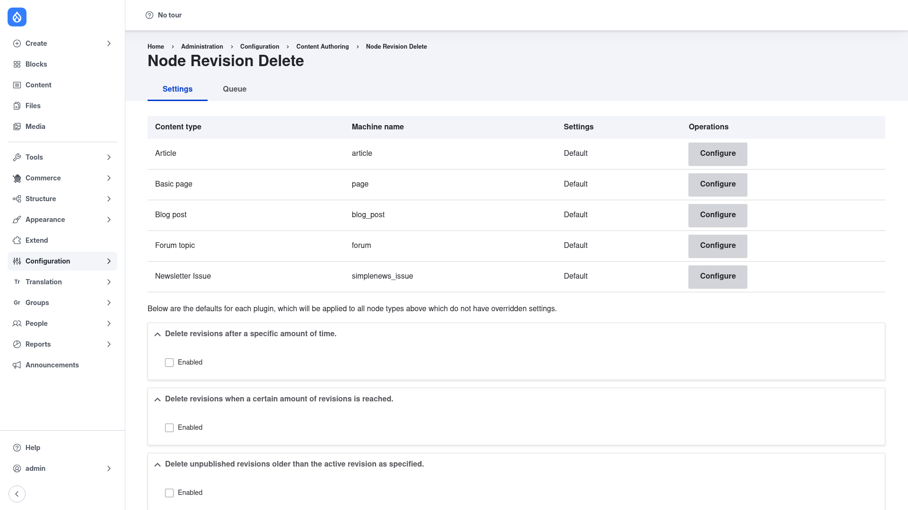

# Configuration — retention rules

The **Settings** tab is where you decide how aggressively revisions are pruned. You
work at two levels: a set of **global defaults** for each pruning strategy, and
**per-content-type overrides** for the types that need different rules. Understanding
that keep-count / age model is the key to configuring the module correctly.

## The keep-count / age model

Node Revision Delete decides which revisions are *candidates* for deletion using a
handful of pluggable strategies. The two you will reach for most often are:

- **Keep a maximum number of revisions.** Set a minimum number of prior revisions
  to keep — say `5` — and any revision beyond that most-recent 5 becomes eligible
  for deletion. This caps how much history each node accumulates.
- **Keep revisions only up to a maximum age.** Set a time period — say six months —
  and any revision older than that becomes eligible for deletion, no matter how many
  there are.

You can enable one or both. When both are on, a revision is a deletion candidate if
it fails either rule. Two further strategies handle draft cleanup — deleting
revisions newer than the current published revision, and deleting unpublished
revisions older than the active one — for sites with a heavy draft workflow.

The current (default) revision of a node is always kept; these rules only ever
prune *prior* revisions.

## Open the Settings tab

1. Go to **Configuration → Content authoring → Node Revision Delete**
   (`/admin/config/content/node_revision_delete`).
2. You land on the **Settings** tab by default.

## Set the global defaults

The top of the page lists every content type on your site — Article, Basic page,
and so on — each showing its current **Settings** (**Default** until you override
it) and a **Configure** button.

Below that table is the line *"Below are the defaults for each plugin, which will
be applied to all node types above which do not have overridden settings."* These
default sections are collapsible fieldsets, one per pruning strategy:

1. **Delete revisions after a specific amount of time** — the age-based rule. Tick
   **Enabled** and set the maximum age; any revision older than that becomes a
   deletion candidate.
2. **Delete revisions when a certain amount of revisions is reached** — the
   keep-count rule. Tick **Enabled** and set the minimum number of revisions to
   keep; anything beyond that most-recent set becomes a candidate.
3. **Delete unpublished revisions older than the active revision** — tick
   **Enabled** to prune stale unpublished/draft revisions that sit behind the live
   revision.

Enable the strategies you want and fill in their values. These apply to every
content type that has **not** been given its own overrides.

## Override a single content type

If one content type needs different rules — for example, keep more history on
Articles than on Basic pages:

1. In the content-type table, click **Configure** on the row for that type.
2. On its form, enable the same strategies and set the minimum number of revisions
   to keep and/or the maximum age you want for **that** type specifically.
3. Save. The type's **Settings** column now shows an overridden value instead of
   **Default**.

To go back to the shared defaults later, use that type's reset option to clear its
overrides.

## Save

Click **Save configuration** at the bottom of the form. Your rules take effect
immediately, but remember they describe which revisions are *eligible* for
deletion — nothing is removed at save time.

## How the deletion actually runs

Saving your settings only defines the policy. The module then:

1. Finds the revisions that now qualify as candidates.
2. Queues those candidates.
3. Deletes them from the queue on the next **cron** run (repeated cron runs work
   through a large backlog a batch at a time).

If you would rather not wait for cron, open the **Queue** tab
(`/admin/config/content/node_revision_delete/queue`) and trigger a run from there.
For scripted maintenance, the `drush node-revision-delete:queue` command queues a
content type on demand — see [Installation](../installation/index.md). This
queue-then-cron design is what lets the module clear even a huge revision backlog
without slowing the site down.
