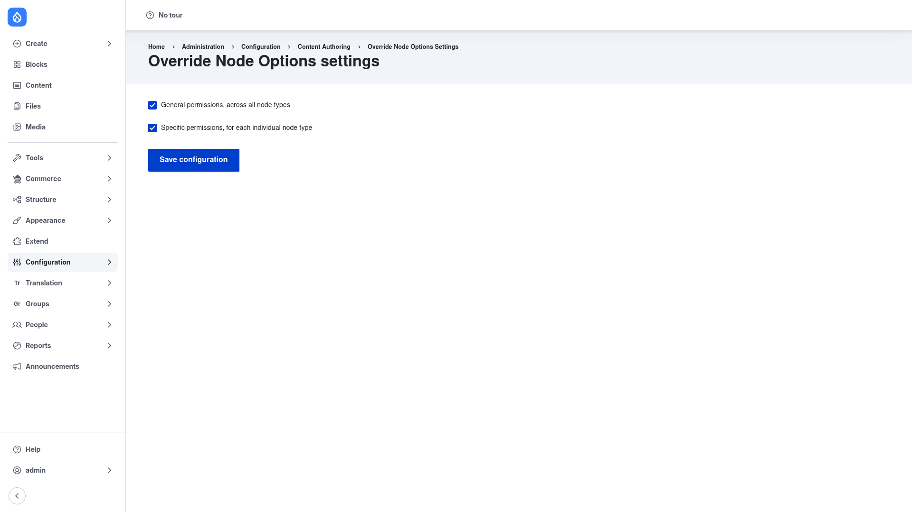

# Configuration

Unlike most modules, Override Node Options is driven almost entirely by
**permissions**, not by a settings form. The settings page offers just two
options; the real work of deciding *who can edit what* happens at **People →
Permissions**. This page covers both, in the order you will use them.

## Step 1 — Choose which permission sets exist (settings page)

The module can generate its permissions in two flavours, and a small settings
form lets you turn each on or off.

1. Go to **Configuration → Content authoring → Override Node Options**
   (`/admin/config/content/override-node-options`).
2. You will see two checkboxes:
   - **General permissions, across all node types** — generates the
     "…all…" permissions that apply to *every* content type at once (for
     example *Override all published option*). Handy on a small site, or when
     you want one role to control a setting site-wide.
   - **Specific permissions, for each individual node type** — generates a
     separate permission set **per content type** (for example *Override
     Article published option*, *Override Page published option*). This is
     what lets you grant publishing control on Articles but not on Pages.
3. Leave both ticked (the default) unless you want to keep the Permissions
   page shorter — for instance, turn *Specific permissions* off on a
   single-content-type site.
4. Click **Save configuration**.



> Turning a set off removes those permissions from the Permissions page. Any
> grants you had made against them simply become inert until you turn the set
> back on.

## Step 2 — Grant the override permissions to your roles

This is the heart of the module. Each permission you grant reveals one control
on the node add/edit form for the roles that hold it.

1. Go to **People → Permissions** (`/admin/people/permissions`).
2. Scroll to the **Override Node Options** section (you can jump straight to it
   with `/admin/people/permissions#module-override_node_options`).
3. For each role, tick the permissions that role should have. The available
   permissions (seven per flavour) map to node-form controls like this:

   | Permission | Reveals on the node form |
   |---|---|
   | *Override … published option* | **Published** checkbox |
   | *Override … promote to front page option* | **Promoted to front page** checkbox |
   | *Override … sticky option* | **Sticky at top of lists** checkbox |
   | *Override … revision option* | **Create new revision** checkbox |
   | *Enter … revision log entry* | **Revision log message** field |
   | *Override … authored by option* | **Authored by** (author) field |
   | *Override … authored on option* | **Authored on** date field |

   The "…" is either **all** (general permissions — applies to every content
   type) or a content type name such as **Article** (specific permissions —
   applies to that type only).
4. Click **Save permissions**.

For example, to let an *Editor* role publish and set the author on Articles
only, tick *Override Article published option* and *Override Article authored
by option* for that role — and leave the *Page* equivalents unticked.

If you prefer the command line, you can grant a single permission with Drush:

```bash
drush role:perm:add editor 'override article published option'
```

## What a correct result looks like

Once a role holds one or more of these permissions, its members will see the
matching controls when they **edit** a node of the relevant type — the
*Publishing options*, *Authoring information*, or *Revision information*
sections reappear on the form, showing only the fields you granted. Everything
else stays hidden, and you never had to hand out *Administer content* /
*administer nodes*.

Two things to keep in mind:

- These permissions only **reveal options** on nodes a user can already edit —
  they do **not** grant edit access. Pair them with core's per-content-type
  *edit* permissions to build a complete workflow.
- A user with *administer nodes* sees every option regardless of these
  settings.
