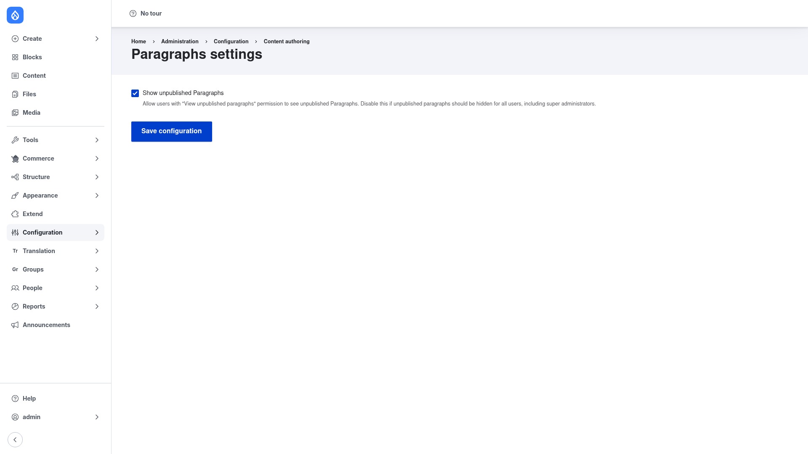

# Configuration — the Paragraphs settings page

Most of Paragraphs' behaviour is configured per Paragraphs type and per field, not
globally. The module does, however, expose one site‑wide settings page. It controls a
single option: whether unpublished paragraphs are visible to users who hold the right
permission.

## Open the settings page

1. Go to **Configuration → Content authoring → Paragraphs**
   (`/admin/config/content/paragraphs`). You need the **administer paragraphs
   settings** permission to reach it.

## Show unpublished Paragraphs

The page has one checkbox, **Show unpublished Paragraphs**, and a **Save
configuration** button.

- **Checked (the default):** users who hold the **View unpublished paragraphs**
  permission can see paragraphs that are unpublished. This lets privileged roles
  preview draft blocks while anonymous visitors do not see them.
- **Unchecked:** unpublished paragraphs are hidden for *all* users — including super
  administrators. Turn this off when a draft paragraph must never render, regardless
  of who is looking.

After changing the checkbox, click **Save configuration** to store it.

## What else counts as "configuration"

The global page is deliberately small. The settings that shape day‑to‑day editing
live elsewhere and are covered under
[Creating a Paragraphs type](../creating-a-paragraph-type/index.md):

- **Per‑type settings** — each Paragraphs type has its own fields, display, and
  optional behavior plugins, managed under **Structure → Paragraphs types**.
- **Per‑field widget settings** — how the paragraphs widget looks and behaves (edit
  mode, add mode, which types are allowed, a default type) is set on the host content
  type's **Manage form display**, on the Entity Reference Revisions field you add.
