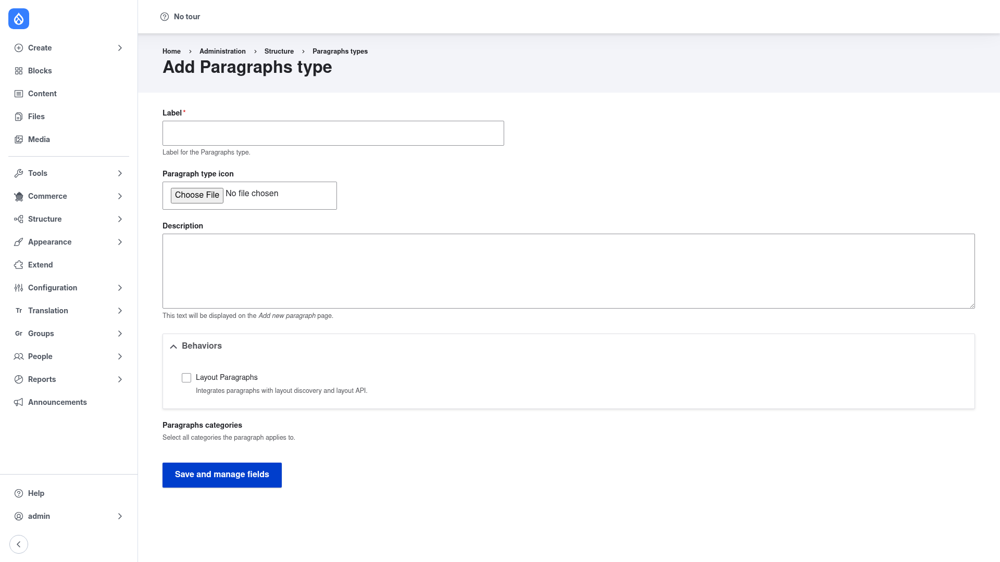

# Creating a Paragraphs type

A **Paragraphs type** is a reusable component — a *Text block*, an *Image*, a *Quote*,
a *Call to action*. Technically it is a bundle for the `paragraph` content entity, so
you build it the same way you build a content type: create the type, then add fields
to it. Once a type exists, you make it available to editors by adding a Paragraphs
field to a content type and choosing which types are allowed. This page covers both
halves.

## Step 1 — Open the Paragraphs types list

Go to **Structure → Paragraphs types** (`/admin/structure/paragraphs_type`). You need
the **administer paragraphs types** permission. The list shows every type you have
created, with its icon, label, machine name, description, and a **Manage fields**
operation.

Click the blue **+ Add paragraph type** button.

## Step 2 — Fill in the Add Paragraphs type form

Fill the form in top to bottom:

1. **Label** *(required)* — the human‑readable name of the component, e.g. *Quote* or
   *Call to action*. Drupal derives the machine name from this automatically. This is
   what editors see when they add a paragraph.
2. **Paragraph type icon** *(optional)* — upload a small image to represent the type.
   The icon shows next to the type in the add menu and in the types list, which helps
   editors pick the right block at a glance.
3. **Description** *(optional)* — a short explanation of what the type is for. This
   text is displayed on the *Add new paragraph* page to guide editors.
4. **Behaviors** *(optional)* — behavior plugins attach extra, non‑field functionality
   to the type (layout options, CSS classes, container settings) that render around
   the paragraph without adding a storage field. Only plugins that apply to this type
   appear here; tick one to enable it. You can leave this empty and add behaviors
   later.
5. **Paragraphs categories** *(optional)* — group the type into one or more categories
   so the add menu can organise many types.

Click **Save and manage fields**. Drupal saves the type and takes you straight to its
**Manage fields** screen.

## Step 3 — Add fields to the type

On the **Manage fields** screen you add fields exactly like you would on any content
type — because a Paragraphs type is just another fieldable bundle. For a *Quote* type
you might add a plain‑text *Quote text* field and a *Attribution* field; for an
*Image* type, an image or media reference. Each field you add becomes part of the form
an editor fills in when they place that paragraph.

You can also visit **Manage display** for the type to control how it renders on the
page, and give it a dedicated Twig template for pixel‑perfect theming. Every
Paragraphs type has its own view display, independent of the others.

Back on the types list you will now see your new type listed with its label, machine
name, and description, ready to be used.

## Step 4 — Use the type on your content

Creating a type does not yet put it in front of editors. Paragraphs are stored in a
special field on the host entity, so the final step is to add that field to whatever
content type (or user, taxonomy term, or any fieldable entity) should carry the
components:

1. Go to **Structure → Content types**, choose the content type you want (for example
   *Landing page*), and open **Manage fields**.
2. Click **+ Add field** and choose the field type **Paragraphs (Entity reference
   revisions)**. Give the field a label such as *Page sections* and set how many
   paragraphs it may hold — usually **Unlimited** so editors can stack as many blocks
   as they like.
3. On the field's **reference settings**, choose **which Paragraphs types are
   allowed** in this field. You can permit every type or restrict the field to a
   curated set (for a landing page you might allow *Hero*, *Text*, *Image*, and *Call
   to action* but not others). You can also order the allowed types and pick a
   **default paragraph type** that is pre‑added when an editor opens the form.
4. Save the field.

Finally, open the content type's **Manage form display**. The Paragraphs field should
use the **Paragraphs** widget (the modern default). This is where you tune the editing
experience — the edit mode (open, closed, or closed with nested items expanded), how
editors add a paragraph (dropdown, buttons, select, or a modal dialog), and optional
buttons such as *Duplicate* and *Add above*. Save the form display.

Now when an editor creates that content type, they will see the Paragraphs field with
your allowed types on offer. They can add components, fill in each one's fields,
collapse them, preview them, and drag‑and‑drop to reorder — including moving
paragraphs between nesting levels when a type contains its own nested Paragraphs
field.
