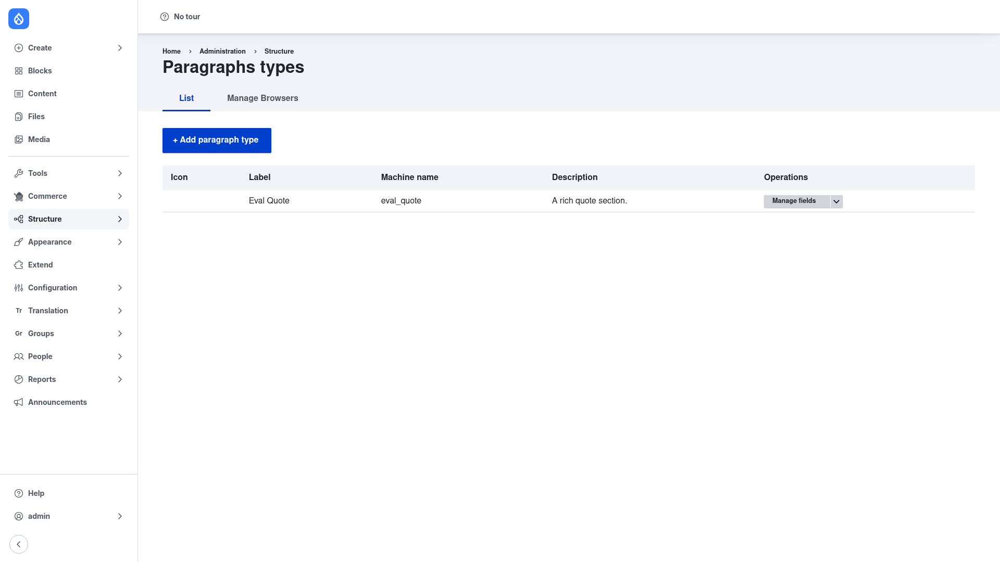

# Paragraphs — manual setup guide

**Paragraphs** (`paragraphs`) lets editors build a page out of reusable, structured
components instead of one freeform WYSIWYG body. Each **Paragraphs type** — a text
block, an image, a quote, a call‑to‑action, a two‑column layout — is a fieldable
bundle with its own fields, display, and Twig template. Editors add, duplicate,
collapse, preview, and drag‑and‑drop these components inside a single field on the
host content, so a page becomes a stack of typed blocks rather than a wall of markup.

Behind the scenes each paragraph is a `paragraph` content entity referenced from the
host through an **Entity Reference Revisions** field, so every block is revisionable
and travels with its parent node's revision history. This guide is written for a
**human** clicking through the admin UI: it walks you, step by step and with
screenshots, from installing the module to creating a Paragraphs type and using it on
your content. If you want terse, token‑cheap references for an AI coding agent, read
the sibling [`agent/`](../agent/start.md) docs instead.

## Contents

1. [Installation](installation/index.md) — install the module with Composer, enable
   it, and choose which bundled submodules you need.
2. [Configuration](configuration/index.md) — the global Paragraphs settings page and
   what the one option there controls.
3. [Creating a Paragraphs type](creating-a-paragraph-type/index.md) — define a
   component type, give it fields, then wire it onto a content type so editors can
   use it.

## Where it lives in the admin menu

- **Paragraphs types:** Structure → Paragraphs types
  (`/admin/structure/paragraphs_type`) — create and manage component types. Add a new
  one at `/admin/structure/paragraphs_type/add`.
- **Global settings:** Configuration → Content authoring → Paragraphs
  (`/admin/config/content/paragraphs`).
