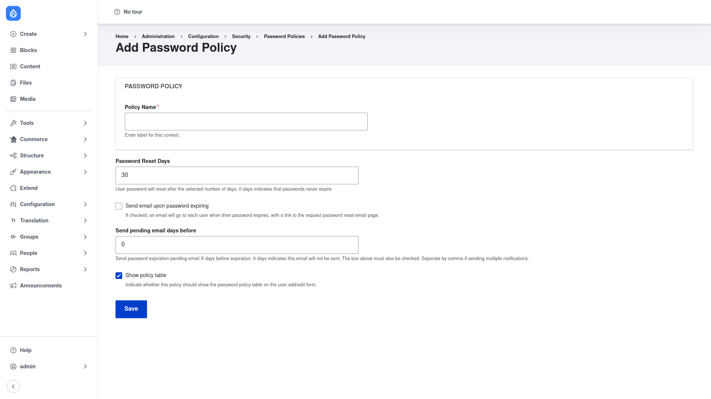

# Creating a policy

A **policy** bundles a set of **constraints** (the individual password rules) and
aims them at one or more **roles**, optionally expiring passwords on a schedule.
This page walks through building one from start to finish.

## 1. Open the Add Policy form

1. Go to **Configuration → Security → Password Policy**
   (`/admin/config/security/password-policy`).
2. Click **+ Add Policy** (`/admin/config/security/password-policy/add`).

The **Add Password Policy** form appears:

## 2. Name the policy and set expiration

Fill in the top of the form:

- **Policy Name** *(required)* — a human-readable label, such as *Editors* or
  *Administrators*, so you can recognise the policy in the list later.
- **Password Reset Days** — how many days a password may be used before it expires
  and the user is forced to set a new one. The default is `30`; enter `0` if you
  do not want passwords to expire on a schedule.
- **Send email upon password expiring** — when ticked, each user is emailed when
  their password expires, with a link to request a password reset.
- **Send pending email days before** — a reminder email sent this many days before
  a password expires. Enter `0` to send no reminder, or a comma-separated list
  (for example `7,1`) to send several reminders on different days. This only works
  if **Send email upon password expiring** is also ticked.
- **Show policy table** — when ticked (the default), users see a live table of the
  policy's requirements on their account form as they type a new password, so they
  can tell which rules they have and have not met.

Click **Save** to create the policy. You are returned to the policies list, and the
policy is now ready to have constraints and roles added to it.

## 3. Add and configure constraints

Constraints are the actual password rules. Edit the policy you just saved and add
constraints to it — each constraint you add comes from a
[submodule you enabled](../installation/index.md) and has its own small settings
form. Add as many as the policy needs. Common choices are:

- **Password length** — set a minimum (or maximum) number of characters, for
  example a minimum length of `12`.
- **Character types** — require the password to include at least N of the four
  character types: lowercase, uppercase, digit, and special. For instance, require
  at least `3` of the `4` types.
- **Password history** — prevent reuse of a user's recent passwords. Set how many
  previous passwords are remembered so a new password cannot match any of them.
- Other constraints from the submodules you enabled: a **blocklist** of forbidden
  passwords, a ban on the **username** appearing in the password, a limit on
  **consecutive** identical characters, or a **delay** between password changes.

Each constraint you add is stored as part of the policy in order. A user's password
must satisfy every constraint in the policy.

## 4. Assign the policy to roles

A policy has no effect until it targets at least one **role**. Choose the roles the
policy should apply to — for example *Content editor* or *Administrator*. Every
user who holds one of those roles is then held to this policy's constraints and
expiration schedule. Give privileged roles a stricter policy (longer minimum
length, more character types, shorter expiry) than ordinary members if you wish;
where a user matches more than one policy, all of the matching policies' rules must
pass.

Save the policy once its constraints and roles are in place.

## What happens next

From now on, when a targeted user sets or changes their password — at registration
or on their account edit form — Drupal checks it against every constraint in the
policy. If **Show policy table** is on, the form displays a live compliance table
showing which requirements are met and which are not, and it will not let the user
save until every constraint passes.

If you set **Password Reset Days** above `0`, passwords age out automatically:
scheduled processing (run on cron) expires passwords older than the limit, sends
any reminder and expiry emails you configured, and forces affected users to set a
new password on their next visit. To rotate passwords immediately instead of
waiting, use the **+ Force Password Reset** button on the
[policies list](../configuration/index.md).
