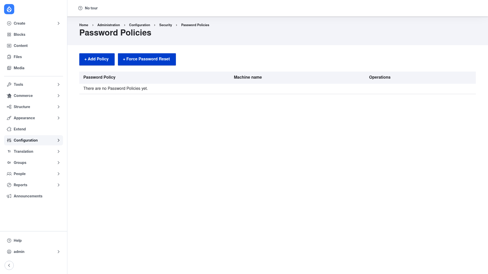

# Password Policy — manual setup guide

**Password Policy** (`password_policy`) lets you enforce rules about the passwords
people choose on your site. You decide what makes a password acceptable —
a **minimum (or maximum) length**, a required mix of **character types** (upper,
lower, digit, special), a ban on the user's own **username**, a **blocklist** of
common or forbidden passwords, a check against the user's recent **password
history** so they cannot reuse an old one, and more. You can also make passwords
**expire** after a set number of days, forcing users to pick a fresh one, and
apply any of this to **specific roles** so administrators can be held to stricter
rules than ordinary members.

Each set of rules lives in a **policy**: a named bundle of **constraints** that
targets one or more roles. The individual rules ship as **submodules** (length,
character types, history, blocklist, and so on), so you enable just the ones you
need and then add them to a policy.

This guide is written for a **human** clicking through the admin UI. It walks you,
step by step and with screenshots, from installing the module to creating your
first policy and assigning it to roles. If you are looking for terse, token-cheap
references for an AI coding agent, read the sibling [`agent/`](../agent/start.md)
docs instead.

## Where it lives in the admin menu

Everything in this guide sits under **Configuration → Security → Password Policy**
(`/admin/config/security/password-policy`). That page lists every policy on the
site and offers two buttons:

- **+ Add Policy** (`/admin/config/security/password-policy/add`) — create a new
  policy.
- **+ Force Password Reset** — immediately expire the passwords of everyone in the
  roles you choose, forcing them to set a new one on their next visit.

## Contents

1. [Installation](installation/index.md) — install Password Policy with Composer
   and enable the constraint submodules you need.
2. [Configuration](configuration/index.md) — understand the policies list and how a
   policy ties constraints to roles.
3. [Creating a policy](creating-a-policy/index.md) — name a policy, add and
   configure its constraints, set expiration, and assign it to roles.
