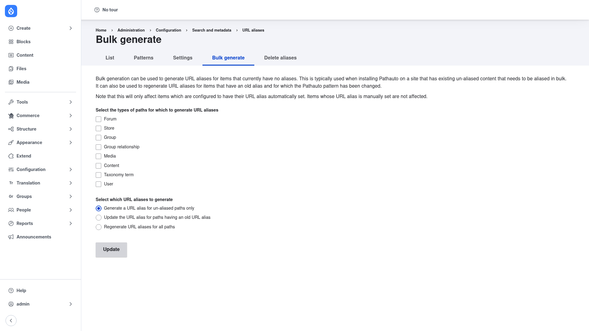

# Bulk generate aliases

When you first install Pathauto, or when you add a new [pattern](../creating-a-pattern/index.md),
existing content does not automatically get an alias — patterns only fire when an
entity is saved. The **Bulk generate** tab back-fills aliases for content that is
already there, in one batch operation.

## Open the Bulk generate tab

1. Go to **Configuration → Search and metadata → URL aliases**
   (`/admin/config/search/path`).
2. Click the **Bulk generate** tab (`/admin/config/search/path/update_bulk`).

As the page explains, bulk generation is typically used when installing Pathauto on
a site that already has un-aliased content, and it can also regenerate aliases after
you change a pattern. It only affects items configured to have their URL alias set
automatically — content whose alias was typed by hand is left untouched.

## Run the batch

1. Under **Select the types of paths for which to generate URL aliases**, tick each
   entity type you want to process (Content, Taxonomy term, User, and any other
   enabled types).

2. Under **Select which URL aliases to generate**, pick the scope:
   - **Generate a URL alias for un-aliased paths only** — the default and safest
     choice; creates aliases only where none exists yet, leaving current aliases
     alone.
   - **Update the URL alias for paths having an old URL alias** — refresh items
     whose alias was generated by a now-changed pattern.
   - **Regenerate URL aliases for all paths** — rebuild every alias from the current
     pattern, overwriting existing automatic aliases.

3. Click **Update**. Pathauto runs a batch process and reports how many aliases it
   created or updated when it finishes.

## Tips

- After editing a pattern, choose **Regenerate URL aliases for all paths** (or the
  "update old alias" option) so existing content picks up the new format.
- If your [update action](../configuration/index.md) is set to *Create a redirect*
  and the Redirect module is installed, regenerating aliases will also leave
  redirects from the old URLs in place.
- To remove aliases in bulk instead — for example before a re-import — use the
  neighbouring **Delete aliases** tab.
