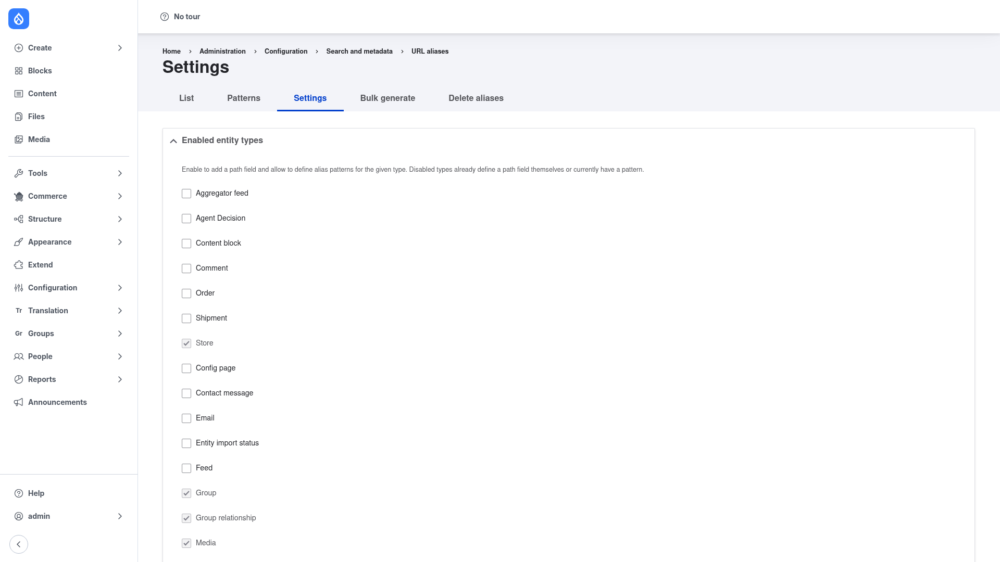

# Configuration — global settings

The **Settings** tab controls how Pathauto cleans and maintains every alias it
generates. These rules apply site-wide, on top of whatever individual
[patterns](../creating-a-pattern/index.md) you define. You can usually leave the
defaults in place, but it is worth understanding each option before you generate
aliases in bulk.

## Open the Settings tab

1. Go to **Configuration → Search and metadata → URL aliases**
   (`/admin/config/search/path`).
2. Click the **Settings** tab (`/admin/config/search/path/settings`).

## Enabled entity types

At the top, **Enabled entity types** lists the entity types Pathauto can manage.
Tick a type to give it a path field and allow patterns to be defined for it.
Types that already define a path field themselves — or that already have a pattern
— are shown disabled, because they are handled automatically. In practice, enabling
a type here is what makes it show up as a **Pattern type** choice when you
[add a pattern](../creating-a-pattern/index.md).

## The cleaning and update options

Scroll down past the entity-type list to reach the general settings. The key
options are:

- **Separator** — the character that replaces spaces and punctuation in a generated
  alias. The default is a hyphen (`-`); some sites prefer an underscore (`_`).
- **Character case** — when enabled, aliases are forced to lowercase, so
  `My Page` becomes `my-page`.
- **Maximum alias length** — the maximum total length of a generated alias
  (default `150`). Longer results are trimmed on a word boundary.
- **Maximum component length** — the maximum length of any single token component
  within the alias (default `100`).
- **Update action** — what happens to the existing alias when the entity is saved
  again and the pattern would produce a different result:
  - *Do nothing* — keep the old alias (URLs never change once set).
  - *Create a new alias, leaving the old one* — both aliases resolve.
  - *Create a new alias, delete the old one* — the default.
  - *Create a redirect* — only available when the **Redirect** module is installed;
    the old URL redirects to the new one. This is the recommended choice for SEO.
- **Transliterate prior to creating alias** — convert accented and non-Latin
  characters to their closest ASCII equivalent (for example `é` → `e`), so titles
  in any language produce clean ASCII slugs.
- **Reduce strings to letters and numbers** — strip any remaining non-alphanumeric
  characters after transliteration. Off by default.
- **Strings to Remove (ignore words)** — a comma-separated list of stop-words
  (`a, an, as, at, the`, …) that are dropped from generated aliases so paths stay
  short and readable.
- **Punctuation** — a per-character list letting you decide, for each punctuation
  mark, whether to remove it, replace it with the separator, or keep it as-is.
- **Verbose** — when enabled, Drupal shows a status message each time an alias is
  generated, which is handy while you are testing patterns.

## Save

Click **Save configuration** at the bottom. Your changes take effect for aliases
generated from that point on. To apply new cleaning rules to content that already
has aliases, regenerate them from the
[Bulk generate](../bulk-generate/index.md) tab.
