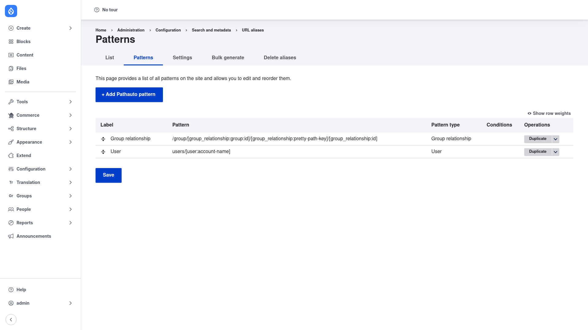

# Installation

## Requirements

Pathauto needs **Drupal 10.2+ or 11** and two contrib modules, which Composer
pulls in automatically:

- **Token** (`token`) — provides the `[node:title]`, `[term:name]`, … placeholders
  you write your patterns with.
- **Chaos Tools / CTools** (`ctools`) — supplies the selection-criteria (condition)
  plugins used to limit a pattern to a specific bundle or language.

It also uses core's **Path** module (`path`) to store the aliases it generates;
that module ships with Drupal and Pathauto enables it as a dependency.

Optional but recommended:

- **Redirect** (`redirect`) — when installed, Pathauto can create a redirect from
  the old URL to the new one whenever an alias changes, so existing links and
  search-engine results keep working. See
  [Configuration](../configuration/index.md).

## Install with Composer

From the project root:

```bash
composer require drupal/pathauto -W
```

The `-W` (`--with-all-dependencies`) flag lets Composer update the `token` and
`ctools` dependencies as needed.

> **Using DDEV?** Prefix Composer and Drush with `ddev` when you run from your host
> machine — `ddev composer require drupal/pathauto -W`, `ddev drush …`. Inside the
> container (`ddev ssh`) run them without the prefix.

## Enable the module

```bash
drush en pathauto -y
```

This also enables `token`, `ctools`, and core's `path` module. Once enabled, the
alias screens appear under **Configuration → Search and metadata → URL aliases**
(`/admin/config/search/path`).

## Verify it worked

Log in as an administrator and go to `/admin/config/search/path/patterns`. You
should see the **Patterns** tab with a **+ Add Pathauto pattern** button:



If the page loads and the tabs (List, Patterns, Settings, Bulk generate, Delete
aliases) are present, the module is installed correctly. Next, review the
[global settings](../configuration/index.md) and then
[create your first pattern](../creating-a-pattern/index.md).
