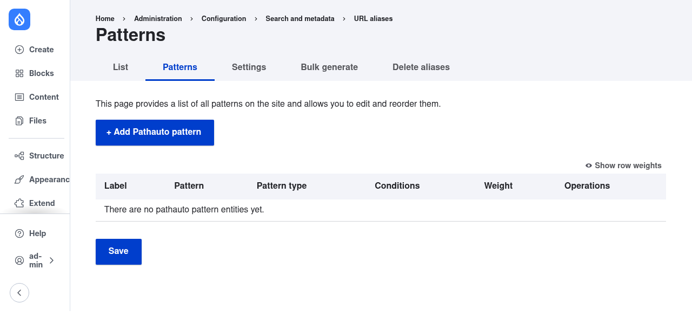
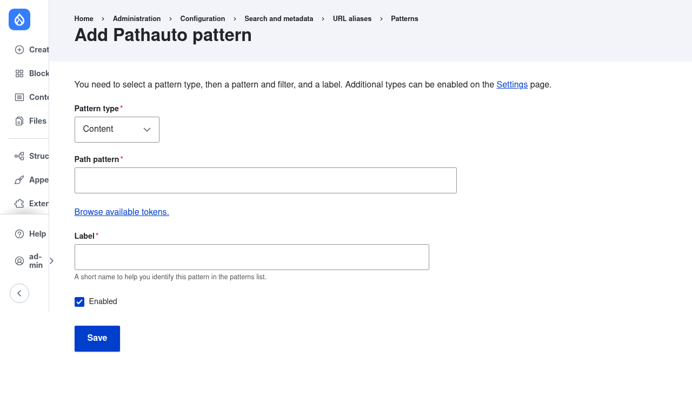

# Configure URL alias patterns

Patterns are config entities `pathauto.pattern.*`. Manage at
`/admin/config/search/path/patterns` (route `entity.pathauto_pattern.collection`).
Permission: `administer pathauto`.

## Via UI
Add pattern → pick a **Pattern type** (an AliasType plugin: Content/`canonical_entities:node`,
Taxonomy term, User, or any custom type) → set the token **pattern** → optionally add
**selection criteria** (conditions, e.g. limit to a content type or language).

Patterns list (`/admin/config/search/path/patterns`):


Add-pattern form — the "Browse available tokens." link is Token's browser (see the token
module docs):


## As config (exportable/deployable)
`config/sync/pathauto.pattern.article.yml`:
```yaml
langcode: en
status: true
id: article
label: 'Article'
type: 'canonical_entities:node'   # AliasType plugin id
pattern: 'blog/[node:title]'      # tokens resolved per entity
selection_criteria:               # optional conditions
  <uuid>:
    id: 'entity_bundle:node'
    bundles: { article: article }
    negate: false
    context_mapping: { node: node }
selection_logic: and
weight: 0
relationships: {}
```

- `type` is the AliasType plugin id. Content entities use `canonical_entities:{entity_type}`.
- `pattern` accepts any token valid for that entity (browse via the Token module).
- Multiple patterns for the same type are tried by `weight`; first match whose
  `selection_criteria` pass wins.
- Import with `drush config:import` (or `drush config:set` for one value).
- After changing a pattern, regenerate existing aliases — see
  [bulk-operations.md](bulk-operations.md).
