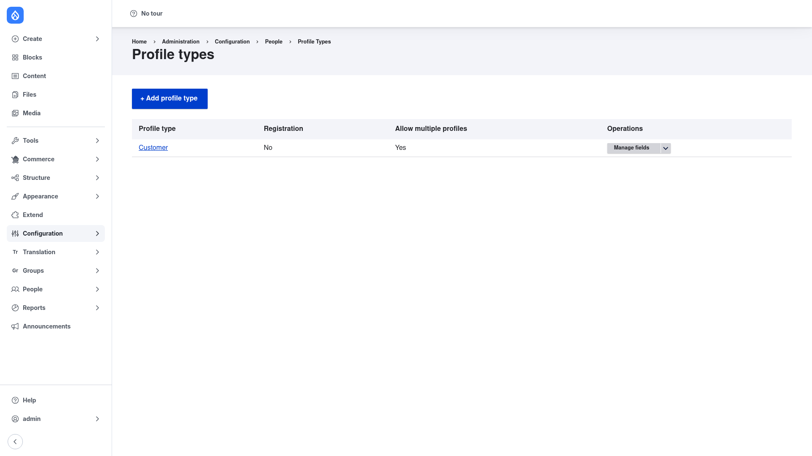

# Configuration — the Profile types list

Profile has no single global settings page. Instead, everything is configured
per **profile type**: each type is its own **fieldable bundle** of the profile
entity, with its own fields and its own options. The **Profile types** list is
the hub where you create, review, and manage those types.

## Open the Profile types list

1. Go to **Configuration → People → Profile types**
   (`/admin/config/people/profile-types`).

## Reading the list

Each row on this page is one profile type. The columns tell you, at a glance,
how each type is set up:

- **Profile type** — the type's label. Click it to edit the type's options.
- **Registration** — *Yes* if this type's fields are attached to the user
  registration form, so people fill it in when they sign up; *No* otherwise.
- **Allow multiple profiles** — *Yes* if a single user can own more than one
  profile of this type (for example several addresses); *No* if each user gets at
  most one.
- **Operations** — actions for the type. The **Manage fields** button is where
  you add the fields that make up the profile (a text field for a bio, an address
  field, and so on), just like managing the fields on a content type.

## Each type is its own bundle

Because every profile type is a separate bundle, the fields you attach to one
type are independent of every other type. An "Address" type can hold address
fields while a "Membership" type holds a tier and a join date, and a user can own
a profile of each — all kept separate from the core user account.

To add a new type, click **+ Add profile type**. That flow is covered in
[Creating a profile type](../creating-a-profile-type/index.md).
