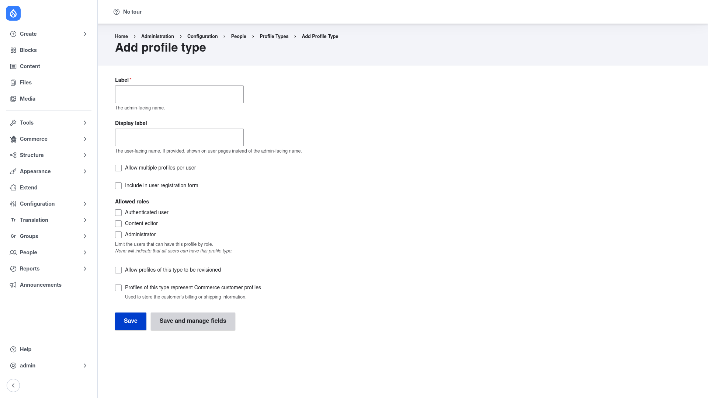

# Creating a profile type

A **profile type** is a bundle of the profile entity — a named kind of profile
(like "Address" or "Membership") that you give its own fields. Creating one is a
few steps: name the type, choose how it behaves, save it, attach fields, and then
let your users fill it in. This page walks through the whole flow.

## 1. Open the Add profile type form

1. Go to **Configuration → People → Profile types**
   (`/admin/config/people/profile-types`).
2. Click **+ Add profile type** to open the add form
   (`/admin/config/people/profile-types/add`).

## 2. Name the type and choose its options

Fill in the form fields:

- **Label** *(required)* — the admin-facing name of the type, such as `Address`
  or `Membership`. This is what you see in the Profile types list.
- **Display label** — the user-facing name. If you provide it, it is shown on the
  user's profile pages instead of the admin label.
- **Allow multiple profiles per user** — tick this to let a single user own more
  than one profile of this type (for example several shipping addresses). Leave it
  unticked to limit each user to at most one profile of the type. Allowing
  multiple profiles also lets a user mark one of them as their **default**.
- **Include in user registration form** — tick this to attach the type's fields
  to the sign-up form, so people fill the profile in when they register.
- **Allowed roles** — tick one or more roles to restrict the type to users who
  hold a listed role. As the help text notes, *None* (no boxes ticked) means all
  users can have this profile type. This restriction is enforced by the module's
  access handler: a user without a listed role is blocked from the type even if
  they otherwise have permission.
- **Allow profiles of this type to be revisioned** — tick this to keep a revision
  history of changes to profiles of this type.

Click **Save** to create the type, or **Save and manage fields** to go straight
to the field-management screen for it.

## 3. Add fields to the type

A brand-new profile type has no fields of its own yet. Back on the **Profile
types** list, use the **Manage fields** operation on your new type to add the
fields that make up the profile — a text field for a bio, an address field, a
date, and so on. This works exactly like managing the fields on a content type.

## 4. Let users fill it in

Once the type has fields, each user gets profile pages under their account where
they can add, view, and edit their profile of that type (and, for multiple types,
choose a default). Which users can do this is governed by the per-bundle
permissions the **Entity API** module generates for each profile type — for
example *view own*, *update own*, and *add own* — plus the role restriction you
set above. See the [permissions reference](../../agent/permissions/permissions.md)
for the full list.
