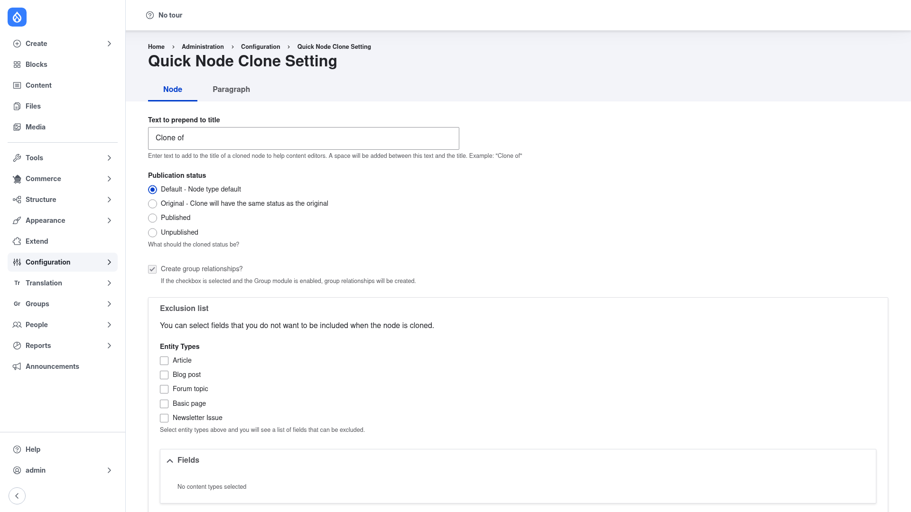

# Quick Node Clone — manual setup guide

**Quick Node Clone** (`quick_node_clone`) adds a **Clone** action to nodes. When
an editor clicks it, the module opens the standard *add content* form already
filled in with a deep copy of the source node's field values, so they can
duplicate an existing piece of content and tweak just the parts that differ
instead of retyping everything. Referenced **Paragraphs** are cloned
recursively, so editing the copy never changes the original.

A small settings page lets you shape those clones: prepend text to the cloned
title (for example the default **Clone of**), choose the publication status of
the new node, and — per content type — pick which fields should be **left out**
of the copy. This guide is written for a **human** clicking through the admin
UI. If you want terse, token-cheap references for an AI coding agent, read the
sibling [`agent/`](../agent/start.md) docs instead.

## Where it lives in the admin menu

The settings for this module sit under **Configuration → Quick Node Clone
Setting** (`/admin/config/quick-node-clone`). That page has two tabs:

- **Node** — the title prefix, clone publication status, group-relationship
  option, and which fields to exclude per content type.
- **Paragraph** — which fields to exclude per paragraph type.

The **Clone** action itself is not on this page — it appears as an operation /
tab on each individual node once you grant the matching permission.

## Contents

1. [Installation](installation/index.md) — install Quick Node Clone with
   Composer, enable it, and grant the clone permission.
2. [Configuration](configuration/index.md) — set the title prefix, choose the
   fields to exclude per content type, and clone a node from the editor UI.
