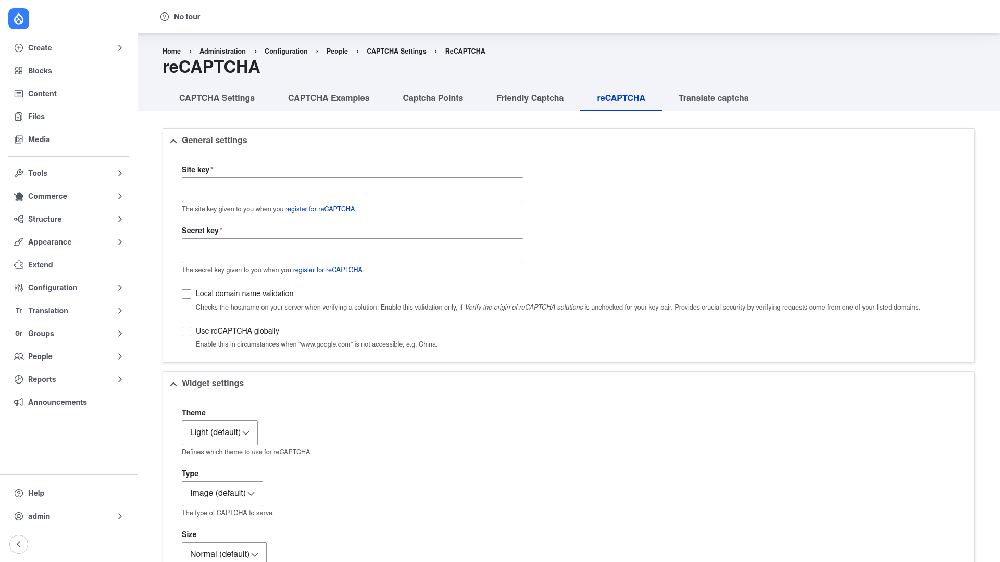

# Configuration

Configuring reCAPTCHA is a two-part job. First you enter your Google keys and pick
the widget's appearance on the **reCAPTCHA** settings form. Then — because
reCAPTCHA is only a *challenge type* — you tell the CAPTCHA module which forms
should use it, on the **Captcha Points** screen (or set reCAPTCHA as the site-wide
default). This page covers both.

## Part 1 — Enter your keys and widget options

### Open the reCAPTCHA settings form

1. Go to **Configuration → People → CAPTCHA**
   (`/admin/config/people/captcha`).
2. Click the **reCAPTCHA** tab (`/admin/config/people/captcha/recaptcha`).

You need the **administer recaptcha** permission to reach this form.

### General settings

- **Site key** *(required)* — paste the public site key Google gave you when you
  [registered your site](../installation/index.md#register-your-site-with-google).
  This is the value rendered into the page so the widget can appear.
- **Secret key** *(required)* — paste the private secret key from the same Google
  registration. It is used only on the server, to verify each visitor's answer, and
  is never exposed to the browser.
- **Local domain name validation** — when ticked, your server also checks the
  hostname reported in the response when verifying a solution. Enable this only if
  *Verify the origin of reCAPTCHA solutions* is unchecked for your key pair in the
  Google console. It adds a layer of security by confirming requests came from one
  of your listed domains. Off by default.
- **Use reCAPTCHA globally** — when ticked, the module talks to `recaptcha.net`
  instead of `www.google.com`. Turn this on only in situations where
  `www.google.com` is not reachable (for example, in China). Off by default.

### Widget settings

Scroll down to the **Widget settings** section to control how the challenge looks
and behaves:

- **Theme** — the colour scheme of the widget: **Light (default)** or **Dark**.
  Pick the one that matches your site.
- **Type** — the kind of challenge to serve: **Image (default)** or **Audio**.
- **Size** — the widget size: **Normal (default)**, **Compact** (for narrow
  layouts), or **Invisible** (no visible checkbox; the challenge runs in the
  background and only interrupts suspicious visitors).
- **noscript fallback** — an option to render a `<noscript>` version of the widget
  so visitors with JavaScript disabled can still complete the challenge.

### Save

Click **Save configuration** at the bottom of the form. Your keys and widget
options are stored and take effect immediately for any form already using the
reCAPTCHA challenge.

## Part 2 — Protect a form with reCAPTCHA

Entering your keys does not yet protect anything. reCAPTCHA registers itself as a
challenge type in the CAPTCHA module; you now choose which forms use it.

### Option A — switch a specific form to reCAPTCHA

1. Go to **Configuration → People → CAPTCHA → Captcha Points**
   (`/admin/config/people/captcha/captcha-points`). This lists every form that has
   (or can have) a CAPTCHA, identified by its form ID — for example
   `user_login_form` or `contact_message_feedback_form`.
2. Find the form you want to protect (or add a new CAPTCHA point for it) and edit
   it.
3. Set the **Challenge type** to **reCAPTCHA (recaptcha/reCAPTCHA)**.
4. Save. That form now shows the reCAPTCHA widget the next time it is rendered.

### Option B — make reCAPTCHA the default challenge

1. Go to **Configuration → People → CAPTCHA** (`/admin/config/people/captcha`).
2. Under the default challenge setting, choose **reCAPTCHA** as the *Default
   challenge type*.
3. Save. Every CAPTCHA point set to use the default challenge now uses reCAPTCHA.

For the full details of CAPTCHA points, default challenges and per-form placement,
see the base CAPTCHA module's
[human-docs](../../../../captcha/2.0.x/human-docs/index.md).

## Verify it worked

Log out (or use a private browser window) and open one of the forms you protected.
You should see the Google reCAPTCHA widget — the "I'm not a robot" checkbox for the
Normal/Compact sizes, or no visible control at all for the Invisible size. Submit
the form to confirm the challenge passes and the submission goes through.
