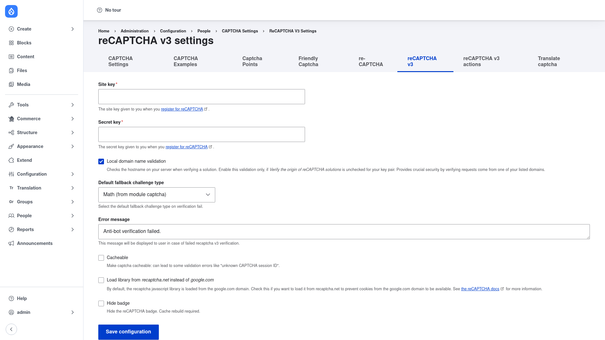

# Configuration

Setting up reCAPTCHA v3 takes three parts: enter your Google keys and global
options on the **reCAPTCHA v3** settings page, define one or more **reCAPTCHA v3
action** challenges (each with a score threshold), and finally assign a challenge
to a form through CAPTCHA's per-form points.

## 1. Enter your keys and global options

1. Go to **Configuration → People → CAPTCHA → reCAPTCHA v3**
   (`/admin/config/people/captcha/recaptcha-v3`).

   

2. In **Site key**, paste the v3 site key Google gave you when you registered your
   site. This is the public key sent to the browser.
3. In **Secret key**, paste the v3 secret key. This is used server-side to verify
   the score and is never exposed to visitors.
4. Review the remaining options — the defaults are fine for most sites:
   - **Local domain name validation** — checks the hostname on your server when
     verifying a submission, so a token cannot be reused from another domain.
   - **Default fallback challenge type** — the challenge shown when a submission
     scores below the threshold and the action is set to use the default (for
     example **Math (from module captcha)**). This is what a suspicious visitor
     sees instead of passing silently.
   - **Error message** — the message displayed to the user if verification fails.
   - **Cacheable** — allow the CAPTCHA element to be cached (note the on-screen
     warning that this can cause "unknown CAPTCHA session ID" validation errors).
   - **Load library from *recaptcha.net* instead of *google.com*** — use this in
     regions where `google.com` is blocked.
   - **Hide badge** — hide Google's reCAPTCHA badge. If you enable this you must
     display the required reCAPTCHA attribution notice elsewhere on the page.
5. Click **Save configuration**.

## 2. Define a challenge with a score threshold

The score threshold lives on a **reCAPTCHA v3 action** — a small config entity that
ties a Google "action" name to a passing score and a fallback challenge.

1. Click the **reCAPTCHA v3 actions** tab at the top of the CAPTCHA settings
   screen, then add a new action.
2. Give it a **label** and a machine name (the machine name is the Google **action**
   name reported for that form).
3. Set the **threshold** — the minimum score, from **0.0 to 1.0**, that a submission
   must reach to pass. Google returns a score where **1.0 is very likely a human**
   and **0.0 is very likely a bot**. A common starting point is **0.5**.
   - **Lower threshold = stricter is wrong — read carefully:** a *higher* threshold
     is stricter (it demands a more human-looking score, so more submissions fall
     through to the fallback challenge). A *lower* threshold is more lenient (more
     submissions pass silently). For example `0.7` blocks more borderline traffic
     than `0.5`, while `0.3` lets more through. Tune it per form: stricter on
     sensitive forms like login, looser on high-traffic public forms.
4. Choose the **fallback challenge** presented when a submission scores below the
   threshold — a specific CAPTCHA challenge, or **default** to use the *Default
   fallback challenge type* you set in step 1.
5. Save the action. Actions are exportable configuration, so you can deploy them
   between environments.

## 3. Assign the challenge to a form

reCAPTCHA v3 only *registers* the challenge type and actions — it does not decide
which forms to protect. You do that with CAPTCHA's per-form **CAPTCHA points**:

1. Go to **Configuration → People → CAPTCHA → Captcha Points**
   (`/admin/config/people/captcha/captcha-points`).
2. Add or edit the CAPTCHA point for the form you want to protect (for example the
   user login or contact form).
3. Choose the reCAPTCHA v3 challenge/action as the **challenge type** for that form
   and save.

Once assigned, that form runs an invisible reCAPTCHA v3 verification on every
submit, and only falls back to a visible challenge when a submission scores below
your threshold.

> For the full details of CAPTCHA points and per-form protection, see the CAPTCHA
> module's own guide:
> [Protecting a form (CAPTCHA)](../../../captcha/2.0.x/human-docs/protecting-a-form/index.md).
