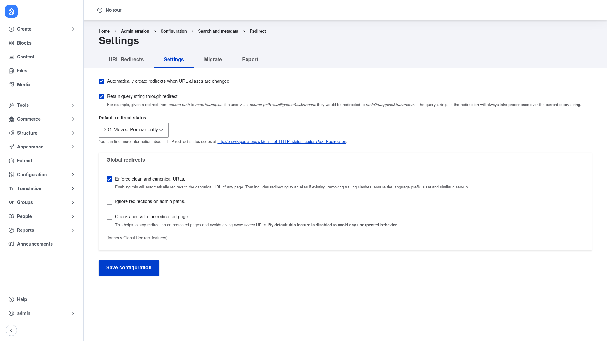

# Configuration — the Settings page

Redirect works out of the box, but a single **Settings** page controls how it behaves
site-wide: whether it creates redirects for you automatically, what status code new
redirects use by default, and whether it enforces clean, canonical URLs. You only
need the **Administer redirect settings** permission to change these; managing
individual redirects is a separate permission.

## Open the Settings page

1. Go to **Configuration → Search and metadata → URL redirects**
   (`/admin/config/search/redirect`).
2. Click the **Settings** tab (or go directly to
   `/admin/config/search/redirect/settings`).

## The options, one by one

### Automatically create redirects when URL aliases are changed

*(Checked by default.)* This is the option most sites keep on. Whenever the URL alias
of a piece of content changes — you rename a node, or Pathauto regenerates an alias —
Redirect creates a 301 from the **old** alias to the new one. Existing bookmarks,
inbound links, and search-engine ranking keep working instead of hitting a 404. Leave
this on unless you have a specific reason to manage every redirect by hand.

### Retain query string through redirect

*(Checked by default.)* Keeps the query string from the incoming request when it
forwards the visitor. As the on-screen help explains: given a redirect from
`source-path` to `node?a=apples`, a visitor arriving at
`source-path?a=alligators&b=bananas` lands on `node?a=apples&b=bananas`. The query
string defined *in the redirect* always wins over the one on the incoming request.
This is useful for preserving tracking parameters (such as `utm_*`) through a
redirect.

### Default redirect status

The HTTP status code applied to **new** redirects unless you pick a different one on
the add form. It defaults to **301 Moved Permanently**. This is the single most
important choice to understand:

- **301 Moved Permanently** — tells browsers and search engines the move is
  *permanent*. Search engines transfer ranking to the new URL and browsers may cache
  the redirect. Use this for pages that have genuinely and permanently moved.
- **302 Found** (temporary) — the move is *temporary*; search engines keep the
  original URL indexed and nothing is cached long-term. Use this for seasonal or
  campaign landing pages, A/B tests, or anything you expect to revert.

When in doubt for a permanent content move, keep 301. The page links to
[Wikipedia's list of 3xx status codes](http://en.wikipedia.org/wiki/List_of_HTTP_status_codes#3xx_Redirection)
for the full set.

### Global redirects

This fieldset (labelled *(formerly Global Redirect features)*) controls site-wide URL
clean-up behaviour:

- **Enforce clean and canonical URLs** — *(checked by default)*. Automatically
  redirects any page to its canonical URL: redirecting to an alias when one exists,
  removing trailing slashes, ensuring the language prefix is set, and similar
  clean-up. This keeps a page reachable at exactly one address, which is good for SEO.
- **Ignore redirections on admin paths** — *(unchecked by default)*. Leave this off
  and admin paths are left alone by redirects. Tick it only if you deliberately want
  redirects to apply on `/admin/*` pages.
- **Check access to the redirected page** — *(unchecked by default)*. When on,
  Redirect checks that the current user is allowed to view the destination before
  redirecting, so protected pages don't leak *secret* URLs. It is off by default to
  avoid unexpected behaviour; turn it on if you redirect to access-restricted pages.

## Save

Click **Save configuration**. Your changes take effect immediately and are stored as
configuration, so they export and deploy between environments with your normal config
workflow.

With the site-wide behaviour set, move on to
[creating a redirect](../creating-a-redirect/index.md).
