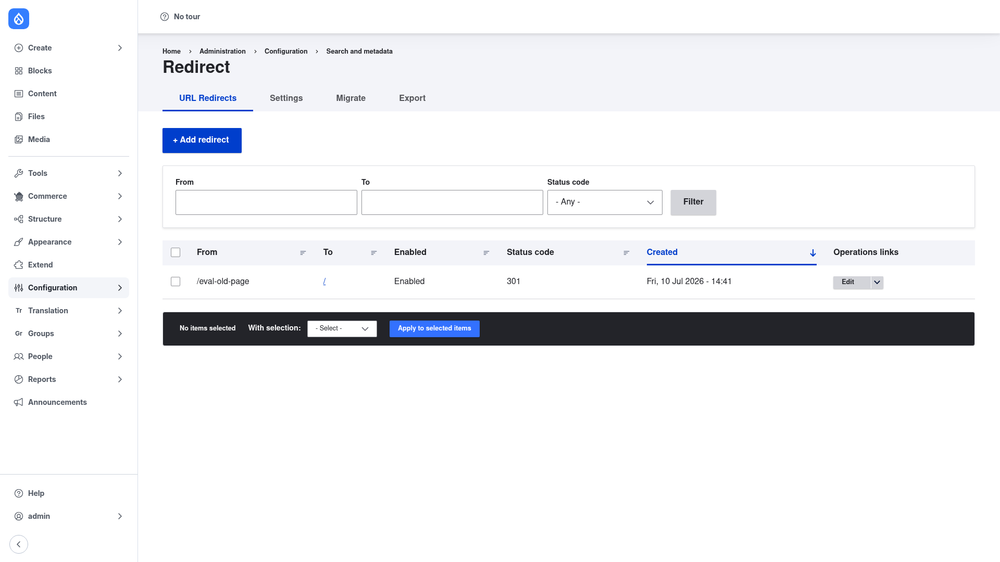
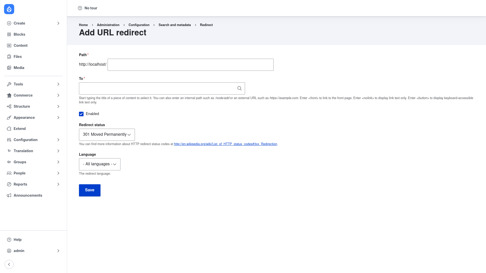

# Creating a redirect

A redirect maps an **old path** on your site to a **destination** and serves it with
an HTTP status code. This page walks through adding one by hand. (Remember that
Redirect can also create redirects *automatically* when an alias changes — see
[Configuration](../configuration/index.md) — so you only need to do this for redirects
you want to define yourself.)

You need the **Administer URL redirects** permission to add or edit redirects.

## Open the redirect list

Go to **Configuration → Search and metadata → URL redirects**
(`/admin/config/search/redirect`). This is the list of every redirect on your site.
Each row shows the **From** path, the **To** destination, whether it is **Enabled**,
its **Status code**, and when it was **Created**, with **Edit** / delete operations on
the right. The **From / To / Status code** filter at the top helps you find a specific
redirect once the list grows.

Click the blue **+ Add redirect** button.

## Fill in the Add URL redirect form

Fill it in top to bottom:

1. **Path** *(required)* — the **old** URL you want to redirect *from*, entered
   relative to your site root (the form shows the site's base URL as a fixed prefix,
   e.g. `http://localhost/`). For example, type `old-page` to redirect
   `/old-page`. Enter an internal path, not a full URL. You can include a query string
   here if you want to match one.
2. **To** *(required)* — the **destination** the visitor should end up on. Start
   typing the title of a piece of content to select it, or enter an internal path such
   as `/node/add` or an external URL such as `https://example.com`. A few special
   values are accepted: `<front>` links to the front page, `<nolink>` displays link
   text with no link, and `<button>` displays keyboard-accessible link text only.
3. **Enabled** *(checked by default)* — leave ticked for the redirect to be active.
   Untick it to keep the record but stop it from firing.
4. **Redirect status** — the HTTP status code for *this* redirect, defaulting to
   **301 Moved Permanently** (or whatever you set as the default on the
   [Settings](../configuration/index.md) page). Choose deliberately:
   - **301 Moved Permanently** — the move is permanent; search engines transfer
     ranking to the destination and the redirect may be cached. Use this for content
     that has genuinely, permanently moved.
   - **302 Found** — the move is temporary; the original URL stays indexed and the
     redirect is not cached long-term. Use this for seasonal or campaign pages you
     expect to change back.
5. **Language** — leave as **- All languages -** unless you want this redirect to
   apply only when the source path is requested in a specific language on a
   multilingual site.

Click **Save**.

## Confirm it worked

You return to the redirect list, where the new redirect now appears as a row with its
**From** path, **To** destination, **Enabled** status, and **Status code**. Test it by
visiting the old path in your browser — you should land on the destination, and your
browser's network tools will show the status code you chose (301 or 302).

To change or remove a redirect later, use the **Edit** button (and its dropdown for
delete) in the **Operations** column of that row, or tick several rows and use the
**With selection** actions at the bottom of the list to delete them in bulk.
