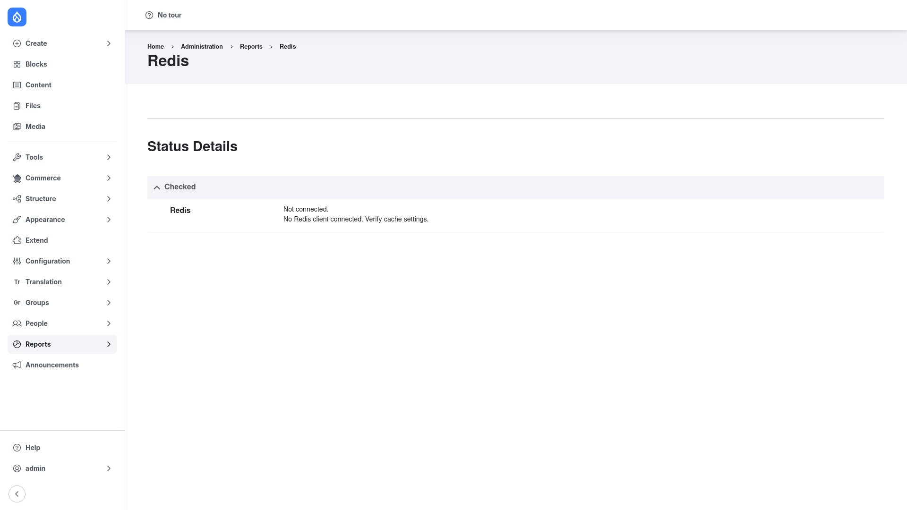

# Configuration

> **Important: Redis is configured in code, not in the admin UI.**
> Unlike most Drupal modules, Redis has **no settings form**. You configure it by
> editing your site's **`settings.php`** file (and, optionally, including a
> services YAML file the module ships). Because the configuration lives in code,
> it travels through Git with the rest of your site — which is exactly what you
> want for a deployable, per-environment setting.

A reference file, `settings.redis.example.php`, ships with the module and shows
the full range of options. The steps below cover the common setup.

## 1. Add the connection settings

Open `settings.php` (typically `sites/default/settings.php`, or a
per-environment `settings.local.php`) and add the connection block:

```php
$settings['redis.connection']['host']      = '127.0.0.1'; // or '/tmp/redis.sock'
$settings['redis.connection']['port']      = 6379;        // 0 for a UNIX socket
$settings['redis.connection']['interface'] = 'PhpRedis';  // PhpRedis | Relay | Predis
// Optional:
$settings['redis.connection']['password']  = 'secret';
$settings['redis.connection']['base']      = 0;           // Redis DB number
```

- **`host`** — the address of your Redis server. Use `127.0.0.1` for a local
  server, a hostname/IP for a remote one, or a socket path like `/tmp/redis.sock`
  for a UNIX socket. If you added Redis through the DDEV add-on, the host is
  `redis`.
- **`port`** — the Redis port (`6379` by default; use `0` for a UNIX socket).
- **`interface`** — which PHP client to use: `PhpRedis`, `Relay`, or `Predis`.
  This must match a client you actually installed (see
  [Installation](../installation/index.md)).
- **`password`** and **`base`** are optional — set a password for an
  authenticated server, and a database number to isolate this site's keys.

The defaults (from the module's client factory) are host `127.0.0.1`, port
`6379`, no password, and no specific database.

## 2. Point Drupal's cache at Redis

Tell Drupal to use the Redis cache backend. To send **every** cache bin to Redis:

```php
$settings['cache']['default'] = 'cache.backend.redis';
```

Or route only specific bins (leaving the rest in the database):

```php
$settings['cache']['bins']['render']             = 'cache.backend.redis';
$settings['cache']['bins']['dynamic_page_cache']  = 'cache.backend.redis';
```

## 3. (Optional) Route lock, flood, and cache-tag checksums through Redis

To also move Drupal's **lock**, **persistent lock**, **flood control** and
**cache-tag checksum** subsystems onto Redis, include the example services
override the module ships:

```php
$settings['container_yamls'][] = 'modules/contrib/redis/example.services.yml';
```

For the bootstrap **container cache** — which lets Redis serve cache even before
the module is fully bootstrapped — you additionally add the module's
`redis.services.yml` to `container_yamls`, register its PSR-4 path with
`$class_loader`, and set `$settings['bootstrap_container_definition']`. The
complete block for this is in the shipped `settings.redis.example.php` reference
file.

## 4. (Optional) Tuning keys

A few extra `$settings` keys let you tune behaviour:

| Setting | Effect |
|---|---|
| `cache_prefix` | A key prefix so several sites can safely share one Redis instance |
| `redis_compress_length` | Compress cache entries longer than N bytes to save memory |
| `redis_ttl_offset` | Add an offset to entry TTLs |
| `redis_invalidate_all_as_delete` | Treat invalidations as deletes (saves memory) |

## 5. Confirm the connection on the report page

After saving `settings.php` (rebuild caches if needed with `drush cr`), go to
**Reports → Redis** (`/admin/reports/redis`) to confirm Drupal is actually
talking to your Redis server. This page is the way to verify your code
configuration took effect.



If the connection is **not** live, the report shows **Not connected** — *No Redis
client connected. Verify cache settings.* — as pictured above. That points to one
of three things: the Redis server is not running or not reachable at the `host`
and `port` you set, the PHP client named in `interface` is not installed, or the
`settings.php` block was not picked up (clear caches and re-check the file).

Once the server, client, and settings all line up, this same page reports the
connected client and server details instead of the *Not connected* message.
