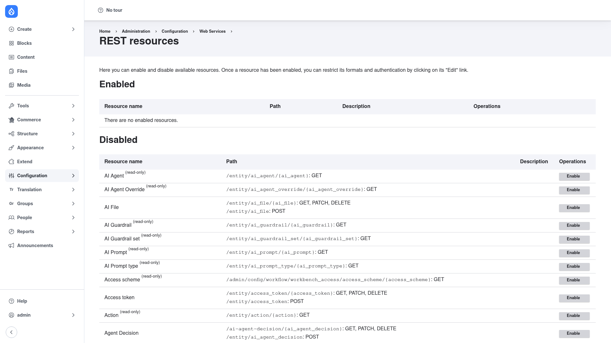

# REST UI — manual setup guide

**REST UI** (`restui`) gives Drupal core's **RESTful Web Services** an
administrative interface. Core lets you expose entities and other resources over a
RESTful API, but on its own it ships no admin screen — to turn a resource on, or to
choose its HTTP methods, serialization formats, and authentication, you would have
to hand-edit the `rest.settings` configuration YAML. REST UI replaces that chore
with a form: a screen that lists every available REST resource and lets you enable,
disable, and configure each one through the browser.

REST UI is purely a management convenience. It defines no resources and stores no
data of its own — everything you set is written straight back into the standard core
`rest.settings` configuration. The actual serving of the API is done by core's
**REST** and **Serialization** modules; REST UI just makes that configuration
clickable.

This guide is written for a **human** working through the admin UI. It walks you,
step by step and with screenshots, from installing the module to enabling and
configuring your first REST resource. If you are looking for terse, token-cheap
references for an AI coding agent, read the sibling [`agent/`](../agent/start.md)
docs instead.

## Where it lives in the admin menu

Everything in this guide sits under **Configuration → Web services → REST**
(`/admin/config/services/rest`). That page — titled **REST resources** — is split
into two sections:

- **Enabled** — the REST resources currently exposed on the site, each with an
  **Edit** and a **Disable** operation.
- **Disabled** — every other resource plugin discovered from core and contrib, each
  with an **Enable** operation.

Access to the screen is gated by core's **Administer REST resources**
(`administer rest resources`) permission.

## Contents

1. [Installation](installation/index.md) — install REST UI with Composer and enable
   it alongside core's REST module.
2. [Configuration](configuration/index.md) — enable a REST resource and configure
   its methods, formats, and authentication providers.
