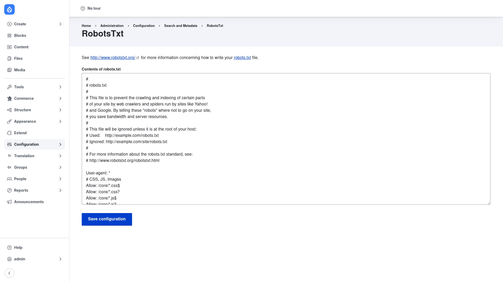

# RobotsTxt — manual setup guide

**RobotsTxt** (`robotstxt`) lets you manage your site's `robots.txt` file from the
Drupal admin UI instead of editing a static file on disk. Rather than sitting as a
fixed file in your docroot, the file is generated **dynamically**: the module
registers a route at `/robots.txt` that builds the response from configuration you
edit in a simple textarea.

This is especially useful in two situations:

- **Multisite installs**, where every site shares the same physical `robots.txt`
  on disk. Because RobotsTxt stores the content per site in configuration, each
  site can serve its own crawler rules from the same codebase.
- **Config-managed workflows**, where you want your `robots.txt` under version
  control. The content lives in the `robotstxt.settings` config object, so it is
  exportable and deployable between environments like any other configuration —
  and it survives core updates that would otherwise overwrite a static file.

This guide is written for a **human** clicking through the admin UI. It walks you,
step by step and with a screenshot, from installing the module to editing your
robots.txt content and verifying the result. If you are looking for terse,
token-cheap references for an AI coding agent, read the sibling
[`agent/`](../agent/start.md) docs instead.

## Where it lives in the admin menu

The module's single settings page sits under **Configuration → Search and metadata
→ RobotsTxt** (`/admin/config/search/robotstxt`). Access is gated by the
**administer robots.txt** permission, so grant it only to trusted roles. The
generated file itself is served publicly at `/robots.txt`.

## Contents

1. [Installation](installation/index.md) — install RobotsTxt with Composer, enable
   it, and remove the physical `robots.txt` so the dynamic route can serve it.
2. [Configuration](configuration/index.md) — edit the robots.txt contents in the
   admin UI, save, and verify the result at `/robots.txt`.
