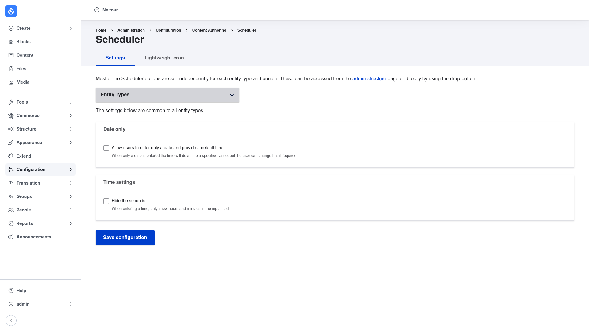

# Scheduler — manual setup guide

**Scheduler** (`scheduler`) lets editors set a future date and time at which a
piece of content is automatically **published**, and/or a later date at which it
is automatically **unpublished** — no one needs to be online when it happens.
When you enable Scheduler for a content type, it adds two optional **Publish on**
and **Unpublish on** date fields to that type's add/edit form. A cron run then
performs the action at the scheduled time: Drupal's normal cron picks up any
content whose scheduled moment has passed and publishes or unpublishes it.

This guide is written for a **human** clicking through the admin UI. It walks you,
step by step and with screenshots, from installing the module to switching on
scheduling for a content type. If you are looking for terse, token-cheap
references for an AI coding agent, read the sibling [`agent/`](../agent/start.md)
docs instead.

## Where it lives in the admin menu

Scheduler has two homes in the admin menu:

- **Configuration → Content authoring → Scheduler**
  (`/admin/config/content/scheduler`) — the site-wide settings page shown above,
  with a **Settings** tab (date/time input options) and a **Lightweight cron**
  tab.
- **Structure → Content types** — where you switch scheduling on for an
  individual content type, using the **Scheduler** vertical tab on the type's
  edit form.

## Contents

1. [Installation](installation/index.md) — install Scheduler with Composer,
   enable it, and make sure cron runs.
2. [Configuration](configuration/index.md) — the module's global settings, and
   how to enable scheduled publishing/unpublishing per content type.
