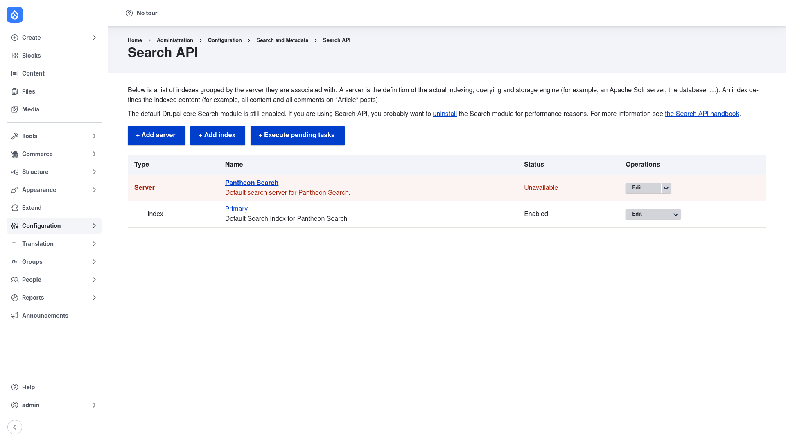

# Configuration

Search API has no single "settings" screen to fill in — you configure it by
building the objects that make up a search. Everything starts from the overview
page and follows the same top-to-bottom flow every time. This page explains that
flow and the concepts behind it; the next page,
[Creating a server and index](../creating-a-server-and-index/index.md), does it
click by click.

## The overview page

Go to **Configuration → Search and metadata → Search API**
(`/admin/config/search/search-api`). This is the home base for all search
configuration. It lists your **servers** and, grouped beneath each one, the
**indexes** that write to it, along with each item's status and an **Edit**
operations menu.

The page also carries three action buttons:

- **+ Add server** — create a new storage/query engine.
- **+ Add index** — create a new definition of what content to index.
- **+ Execute pending tasks** — run any indexing or maintenance tasks that Search
  API has queued (for example after a large configuration change).

> Note: Drupal's core **Search** module may still be enabled after you install
> Search API. If you are using Search API for your site search, you will usually
> want to uninstall the core Search module for performance reasons.

## The overall flow

Building a search always moves through these stages, in order:

1. **Add a server.** A *server* represents the actual engine that stores and
   queries your data. When you create it you pick a **backend** — for example the
   bundled **Database** backend or **Solr**. The backend determines the engine's
   capabilities and connection settings.

2. **Add an index.** An *index* defines *what* gets searched. You choose one or
   more **datasources** (usually entity types such as Content or Users), attach it
   to a server, and pick a **tracker** that keeps a queue of which items still need
   indexing.

3. **Add fields.** On the index's **Fields** tab you choose which properties of
   your entities to index — title, body, author, taxonomy, and so on. Each field
   gets a **type** (for example *Fulltext* for searchable text) and can be given a
   **boost** so matches in it rank higher.

4. **Configure processors.** On the **Processors** tab you enable and order the
   pipeline that transforms text before it is stored — HTML filtering,
   tokenizing, ignore-case, stemming, aggregated fields, rendered-item indexing,
   and more. Processors are what make search behave sensibly.

5. **Index your content.** On the index's **View** tab you run the initial
   indexing batch. After that, new and changed content is indexed automatically on
   cron (and immediately on save, if enabled). You can also index from the command
   line with `drush search-api:index`.

Both **servers** and **indexes** are stored as exportable Drupal configuration, so
once you have built them you can deploy them between environments like any other
config.

## Displaying results

Configuration only fills the index — it does not put a search page on your site.
To show results to visitors you build a **View** whose display type is *Search
API*, pointed at your index; that lets you add exposed filters, a search box, and
paging. Creating that view is covered at the end of
[Creating a server and index](../creating-a-server-and-index/index.md).
