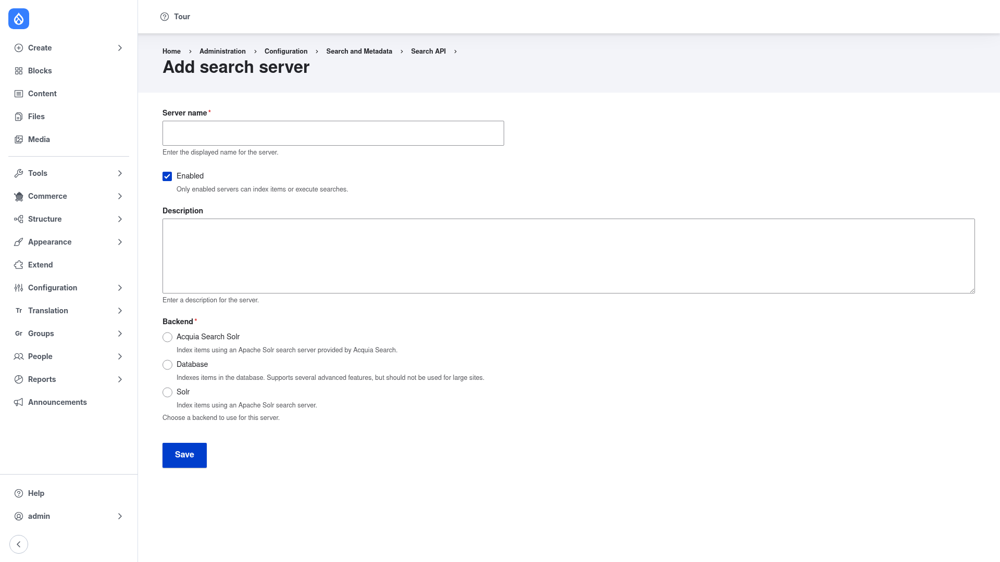

# Creating a server and index

This page walks through building a working search from scratch: a **server**
backed by the Database backend, an **index** over your content, the **fields** you
want searchable, and the initial **indexing** run. At the end it points you at the
view that turns the index into a search page for visitors.

Before you start, make sure Search API and a backend submodule are installed — see
[Installation](../installation/index.md). This guide uses the bundled **Database
Search** (`search_api_db`) backend so no external server is needed.

## Step 1 — Add a server

A *server* is the engine that stores and queries your indexed data.

1. Go to **Configuration → Search and metadata → Search API**
   (`/admin/config/search/search-api`).
2. Click **+ Add server** (`/admin/config/search/search-api/add-server`).

You land on the **Add search server** form:



Fill it in:

1. **Server name** — the displayed name for the server, e.g. *Database server*.
   A machine name is generated automatically.
2. **Enabled** — leave this checked. Only enabled servers can index items or run
   searches.
3. **Description** — an optional note describing the server.
4. **Backend** — choose the engine. Select **Database** to index items in your
   site's database (supports many advanced features; not recommended for very
   large sites). Other options such as **Solr** appear here only if you have
   installed the corresponding module.
5. Choosing a backend may reveal extra backend-specific settings below. The
   Database backend's defaults are fine to start with.

Click **Save**. You return to the overview page, where the new server now appears.

## Step 2 — Add an index

An *index* defines which content gets searched and where it is stored.

1. Back on the overview page, click **+ Add index**
   (`/admin/config/search/search-api/add-index`).
2. Fill in the index form:
   - **Index name** — e.g. *Content index*.
   - **Data sources** — tick the entity types to index, such as **Content**
     (nodes), **Users**, or **Taxonomy term**. Each datasource you enable can be
     configured further (for example limiting it to certain content-type bundles).
   - **Server** — select the server you created in Step 1 so the index knows where
     to store its data. (You can also create an index without a server for now and
     assign one later.)
   - **Index options** — you can choose whether to index items immediately when
     they are saved, and set how many items are processed per cron run.
3. Click **Save and add fields** to continue straight to field selection (or
   **Save** to finish and add fields later).

## Step 3 — Add fields

Fields are the specific properties that become searchable.

1. Open the index and click the **Fields** tab.
2. Use **+ Add fields** to pick properties from your datasources — for example
   **Title** and **Body** from Content, or **Name** from Users. You can follow
   entity references to index related data too.
3. For each field, set its **Type**. Choose **Fulltext** for text you want to
   search by keyword; other types (string, integer, date) are for filtering and
   sorting.
4. Optionally set a **Boost** on a field so matches there rank higher — a common
   choice is to boost **Title** above **Body**.
5. Click **Save** to store the field configuration.

## Step 4 — Configure processors (optional but recommended)

Click the **Processors** tab to enable the text-processing pipeline. Useful
starting processors include **HTML filter** (strips markup), **Tokenizer**
(splits text into words), and **Ignore case**. Enable the ones you need, order the
processing stages at the bottom of the form, and click **Save**.

## Step 5 — Index your content

1. Open the index and click the **View** tab. It shows the tracking status — how
   many items are tracked versus already indexed.
2. Click **Index now** to run a batch that indexes the tracked items.

After this initial run, new and changed content is indexed automatically on cron
(and immediately on save, if you enabled that option). You can also index from the
command line:

```bash
drush search-api:index
drush search-api:status
```

## Step 6 — Display the results with a view

Filling the index does not by itself create a search page. To show results to
visitors, build a **View**:

1. Go to **Structure → Views → Add view**.
2. Under **View settings → Show**, choose your Search API index as the data source
   (it appears in the list once the index exists).
3. Add a page display, add a **Fulltext search** exposed filter so visitors get a
   search box, choose which fields or rendered entities to show, and save.

The view now runs Search API queries against your index and renders the matches —
a complete, working search page. From here you can layer on extras like the
**Facets** module for filtered search or **Search API Autocomplete** for
type-ahead suggestions.
