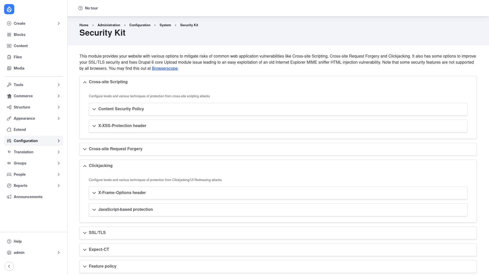

# Installation

## Requirements

Security Kit needs **Drupal 9.5, 10, or 11** (`^9.5 || ^10 || ^11`). It has no
contrib module dependencies and no third-party library requirements — it is a
self-contained module that only shapes outgoing HTTP headers, so it is a
low-risk addition to almost any site.

## Install with Composer

From the project root:

```bash
composer require drupal/seckit -W
```

The `-W` (`--with-all-dependencies`) flag lets Composer update any shared
dependencies as needed.

> **Using DDEV?** Prefix Composer and Drush with `ddev` when you run them from
> your host machine — `ddev composer require drupal/seckit -W`, `ddev drush …`.
> Inside the container (`ddev ssh`) run them without the prefix.

## Enable the module

```bash
drush en seckit -y
```

## Verify it worked

Log in as an administrator and go to **Configuration → System → Security Kit**
(`/admin/config/system/seckit`). You should see the Security Kit settings page
with its collapsible sections — Cross-site Scripting, Cross-site Request
Forgery, Clickjacking, SSL/TLS, Expect-CT, and Feature policy:



If the page loads and those sections are present, the module is installed
correctly. Nothing is enforced yet — every protection is off until you turn it
on. Head to [Configuration](../configuration/index.md) to enable the headers
your site needs.
