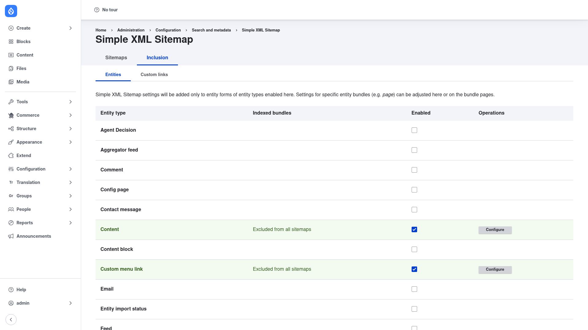
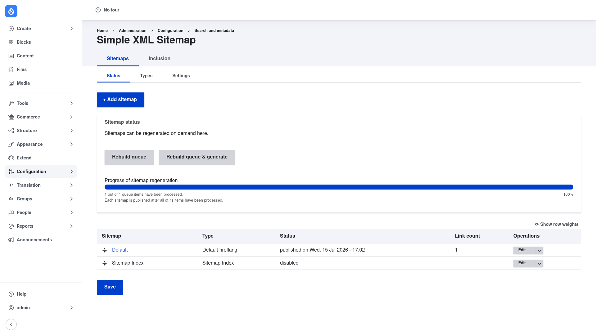

# Choosing which content is included

A fresh sitemap is empty: Simple XML Sitemap indexes **nothing** until you tell it
which entity types to include. You do that on the **Entities** screen, then refine
inclusion per bundle (per content type, per vocabulary, and so on), and finally
regenerate so the changes reach `/sitemap.xml`.

## Enable an entity type

Go to **Configuration → Search and metadata → Simple XML Sitemap**, click the
**Inclusion** top tab, and open the **Entities** sub‑tab
(`/admin/config/search/simplesitemap/entities`).

The table lists every entity type on your site — **Content** (nodes), **Comment**,
**Custom menu link**, **Taxonomy term**, **User**, and any custom entities. For each
row:

1. Tick the **Enabled** checkbox for an entity type you want in the sitemap (for
   example **Content** to index your nodes, or **Taxonomy term** for term pages).
   Enabling a type also adds a Simple XML Sitemap section to that entity's edit
   form, so editors can later override inclusion on individual items.
2. The **Indexed bundles** column summarises the current state — for example
   *Excluded from all sitemaps* until you configure a bundle to be included.
3. Click **Configure** on an enabled row to set per‑bundle options (next section).
4. Click **Save** at the bottom of the screen to persist which entity types are
   enabled.

> Enabling an entity type does **not** by itself index its content — it makes the
> type *available*. You still choose, per bundle, whether it is included.

## Configure a bundle: inclusion, priority, changefreq

Click **Configure** next to an enabled entity type to open its bundle settings.
There you choose, for each bundle (for **Content** that means each content type,
e.g. *Article* and *Basic page*):

- **Index** — whether this bundle's entities are included in the sitemap. Set it to
  *Index …* to include the bundle, or leave it excluded to keep it out. This is the
  switch that actually puts a content type's pages into `/sitemap.xml`.
- **Priority** — a hint from **0.0 to 1.0** telling search engines how important
  these pages are relative to the rest of your site. The default is **0.5**. Raise
  it for cornerstone content (say **1.0** for your home/article pages), lower it for
  minor pages.
- **Change frequency (`changefreq`)** — how often these pages typically change
  (*always, hourly, daily, weekly, monthly, yearly, never*). It is a hint to
  crawlers, not a guarantee.
- **Include images** — when available, adds image references from the entity's
  image fields, producing an image sitemap alongside the page links.

Save the bundle form. You can also override priority and changefreq for a single
node directly on its own edit form, in the **Simple XML Sitemap** section that now
appears there.

## Custom links

The **Custom links** sub‑tab (next to Entities, under **Inclusion**) lets you add
arbitrary internal paths that are not tied to an entity — handy for a hand‑built
landing page or a route that has no node behind it. Add the path and its
priority/changefreq, and it joins the sitemap on the next regeneration.

## Regenerate and view your sitemap

Enabling content changes the *configuration*, but the served `/sitemap.xml` only
updates when the sitemap is **regenerated**. Go back to the **Sitemaps** top tab and
open the **Status** sub‑tab (`/admin/config/search/simplesitemap`):

On this screen:

1. Click **Rebuild queue & generate** to rebuild immediately. Simple XML Sitemap
   queues every item to be indexed and processes the queue right away; the
   **Progress of sitemap regeneration** bar fills to 100% and each sitemap is
   published once all of its items have been processed.
   - **Rebuild queue** (without generate) only refreshes the queue of items to
     process — useful when you intend to let cron do the actual generation.
2. When it finishes, the table at the bottom shows each sitemap's **Status** —
   for example *published on Wed, 15 Jul 2026* — and its **Link count**. A rising
   link count confirms your newly included content was picked up.
3. Click the sitemap's name (**Default**) in that table, or just visit
   **`/sitemap.xml`** in your browser, to view the generated XML. If you enabled
   *Add styling and sorting* in [Configuration](../configuration/index.md), you get
   a readable, sortable table instead of raw XML.

You can also regenerate from the command line at any time with
`drush simple-sitemap:generate`, which is equivalent to **Rebuild queue &
generate**.
