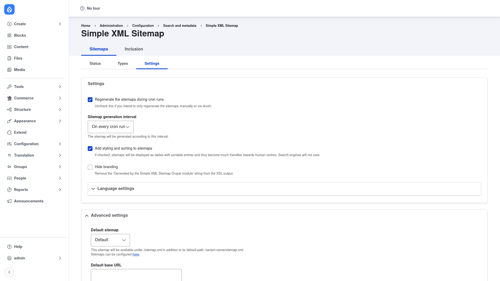

# Configuration — the Settings tab

The **Settings** tab controls *how* and *when* sitemaps are generated, and how the
XML is presented. It does not decide which content is included — that is the
[Entities](../choosing-content/index.md) screen. To open it, go to **Configuration
→ Search and metadata → Simple XML Sitemap**, stay on the **Sitemaps** top tab, and
click the **Settings** sub‑tab (`/admin/config/search/simplesitemap/settings`).



Work through the fields top to bottom.

## Regeneration on cron

1. **Regenerate the sitemaps during cron runs** — when ticked (the default), your
   sitemaps are rebuilt automatically as part of Drupal's normal cron. Untick it if
   you would rather regenerate only by hand or from Drush (see below).
2. **Sitemap generation interval** — a dropdown that throttles how often cron
   actually rebuilds. The default is **On every cron run**; you can pick a longer
   interval (for example once a day) so large sites do not regenerate too
   frequently. This setting only matters while cron regeneration is enabled.

## XML presentation

3. **Add styling and sorting to sitemaps** — when ticked, the sitemap is rendered
   as a sortable, human‑friendly table (via an XSL stylesheet) so a person opening
   `/sitemap.xml` in a browser sees a readable page. Search engines ignore the
   styling either way, so this is purely for human visitors.
4. **Hide branding** — removes the "Generated by the Simple XML Sitemap Drupal
   module" line from that styled output. Leave it unticked to keep the credit.
5. **Language settings** — a collapsible section for multilingual behaviour (for
   example how language variants and `hreflang` alternates are emitted). Expand it
   only if you run more than one language.

## Advanced settings

Expand **Advanced settings** for the less‑common options:

- **Default sitemap** — chooses which variant is served at the bare `/sitemap.xml`
  path (in addition to its own `/{variant-name}/sitemap.xml` path). The **here**
  link on this form jumps to the sitemap list where variants are managed.
- **Default base URL** — an explicit base URL to prefix every generated link with.
  Leave it blank to use the site's own URL; set it when you need sitemaps to point
  at a specific canonical domain (useful behind proxies or on multi‑domain setups).
- **Maximum links in a sitemap** — the chunk size. When a sitemap would exceed this
  many links it is split into numbered chunks under a sitemap index, keeping each
  file within the sitemaps.org size limits. The default is fine for most sites;
  lower it only if you hit size limits.

## Save

Click **Save configuration** at the bottom to store your changes. Settings changes
take effect on the *next* regeneration — to apply them immediately, regenerate from
the [Status screen](../choosing-content/index.md#regenerate-and-view-your-sitemap)
or run Drush.

## Regenerating from the command line

Whether or not cron regeneration is on, you can always rebuild on demand:

```bash
drush simple-sitemap:generate
```

This is the scripted equivalent of the **Rebuild queue & generate** button on the
Status screen.
